```{r setup, include=FALSE}
knitr::opts_chunk$set(echo = FALSE, warning = FALSE, message = FALSE)
```

```{r, include=FALSE}
tcol <- function(a="",b="",width=50){
    cat(':::: {.columns}\n')
    cat('::: {.column width="')
    cat(width)
    cat('%"}')
    cat("\n\n")
    cat(a)
    cat("\n\n:::\n::::\n")
    cat('::: {.column}\n')
    cat('::: {.column width="')
    cat(100-width)
    cat('%"}')
    cat("\n\n")
    cat(b)
    cat("\n\n:::\n::::\n")
}
```

## ⭐ Content

* Motivation

  * Discrete Models

* Schramm Loewner Evolution

  * Loewner Differential Equation

  * $\operatorname{SLE}_{\kappa}$

* Conformal Restriction Property

* Results

* Some Problems


## ⭐ Motivation

:::: {.columns}
::: {.column width=70%}

* 相變 Phase Transition (參數$\color{red}{\text{臨界值(critical value)}}$的性質變化).

  * 水的三相（氣相、液相、固相）變化.
  
  * Superconductivity 超導現象: 材料在低於某一溫度時，電阻變為零的現象.
  
  * Ferromagnetism 鐵磁性: 加熱磁鐵超越某(臨界)溫度 $T_c$ 時, 瞬間失去磁性.

* Schramm Loewner Evolution (SLE, with a parameter $\kappa$): To describe the $\color{red}{\textbf{limit}}$ of the two-dimensional lattice models in statistical physics in the critical case.
  * **Example** : A model to describe the Ferromagnetism is the $\color{blue}{\text{Ising Model}}$.
    * This model shows why we always consider the critical case.
  * Other: Loop-erased random walk (LERW), Self-avoiding walk (SAW), Spin-Ising model, Harmonic explorer (HE), Percolation, Uniform spanning tree (UST) Peano curve.

* Different physics models can be described by SLE (with different parameter $\kappa$).

* SLE is related to conformal transformations.

* We first introduce some discrete models and then introduce conformal transformations.

:::

::: {.column width=30%}

:::
::::

## Ising Model

* The Ising model was introduced by @Lenz460663, @ising1925beitrag, @peierls1936ising to study the Ferromagnetism.

:::: {.columns}
::: {.column}
* Squares of two arrows, representing spins $s=\pm1$

* We want that, for some parameter $x,$
  \begin{align*}
    \begin{aligned}
    \texttt{Prob}\asymp x^{\#\left\lbrace \pm\text{agreeing neighbors(同號鄰居)} \right\rbrace}.
    \end{aligned}
  \end{align*}
* We set a probability mass function by 
  \begin{align*}
    \begin{aligned}
    \mathbf{P}\big(\lbrace \omega\rbrace\big) = C \exp\Big( \frac{1}{T} \sum_{u\sim v}s_u s_v \Big),
    \end{aligned}
  \end{align*}
  where the summation is over all neighbor pairs in $V$ and $C$ is a normalization constant.
  * $T$: The temperature of this model.

:::

::: {.column}

{width=80%}

:::
::::

* The more number of agreeing neighbor of $\omega,$
the more probability mass of $\omega.$

* If $T$ is larger (corresponds to higher temperature),
then the difference between each $\mathbf{P}(\lbrace \omega \rbrace)$ is smaller.

* This is a good model to describe the Ferromagnetism.
  * Critical temperature?


## Ising Model


:::: {.columns}
::: {.column width="40%"}

* Theorem. @kramers1941statistics
  : The critical inverse temperature $\frac{1}{T_c}=\frac{1}{2}\log(1+\sqrt 2).$


:::

::: {.column width="60%"}

* To simply the question, we always consider the $+,-$ boundary conditions and see the interface(交界).
  
{width=65%}
{width=32%}

* This is why we always consider the critical case.

* When $\delta$ is small, the interface of $+,-$ spins for the critical case 
looks like a random fractal curve.

* Theorem. @chelkak2012universality, @chelkak2014convergence
  : The Critical Ising interface with $+,-$ boundary conditions $\implies$ $\operatorname{SLE}_3.$

:::
::::

## Loop-erased random walk (LERW)

:::: {.columns}

::: {.column}

{width=90%}

:::

::: {.column}

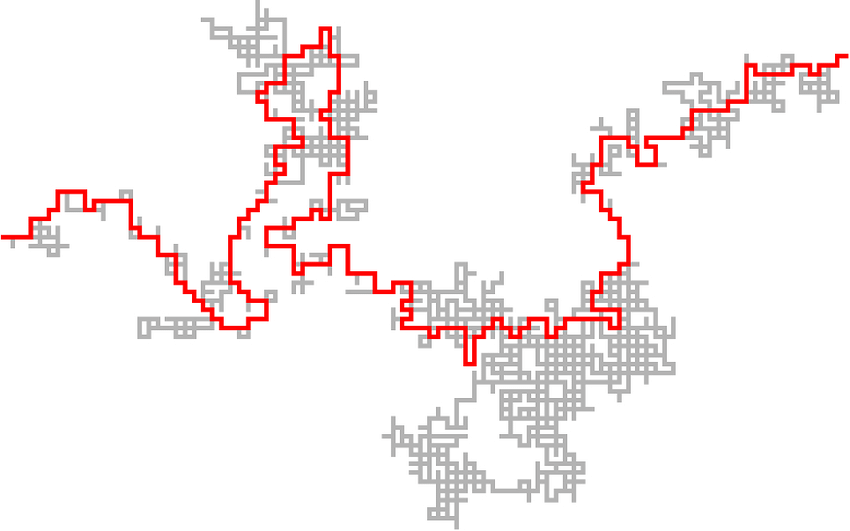

:::

::::

* @schramm2000scaling
  :  Loop-erased random walk $\implies$ $\operatorname{SLE}_{2}.$

## Harmonic explorer

:::: {.columns}
::: {.column width="70%}

{width=99%}

:::
::: {.column width="30%}

:::
::::

## Harmonic explorer

:::: {.columns}
::: {.column width="70%}

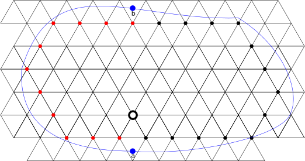{width=99%}

:::
::: {.column width="30%}
* Consider $f=1$ on $\bullet,$ $f=0$ on $\color{red}{\bullet}.$
* Then there exists a unique harmonic function $u$ defined on all sites in $D$ such that $u=f$ on all $\bullet,\color{red}{\bullet}.$
* Coloring $\circ$ randomly by 
  \begin{align*}
    \begin{aligned}
    \mathbf{P}[\circ = \bullet]=u(\circ), \quad
    \mathbf{P}[\circ = \color{red}{\bullet}] = 1-u(\circ).
    \end{aligned}
  \end{align*}
:::
::::

```{r, results='asis'}
for (i in 3:14) {
  cat("## Harmonic explorer\n\n")
  cat(paste0(", ".svg" ,"){width=46%}\n\n"))
  }
```

## Harmonic explorer

:::: {.columns}
::: {.column width="70%}

{width=99%}

:::

::: {.column width="30%}

Theorem. @schramm2005harmonic
: Harmonic explorer $\implies$ $\operatorname{SLE}_4.$ 

:::
::::

```{r, results='asis'}
for (i in 1:4) {
  cat(paste0("## Uniform spanning tree (UST) Peano curve\n\n, ".svg" ,"){width=40%}\n\n"))
  }
```

## Uniform spanning tree (UST) Peano curve

:::: {.columns}
::: {.column width="42%"}

{width=100%}

:::

::: {.column}

Theorem. @lawler2004conformal
: UST Peano curve $\implies$ $\operatorname{SLE}_8.$
  
:::
::::


## Percolation (滲流理論)

:::: {.columns}
::: {.column}

* A physical question: **How does water flow through a rock?**


:::

::: {.column}

* We see the site (vertex) percolation on the triangular lattice $\mathcal{T}.$
  * Blue $\iff$ Water.
  
{width=60%}

:::
::::

## Percolation (滲流理論)

* Site percolation on equilateral triangles $\iff$ Percolation on hexagons.

* {width=60%}

## Percolation (滲流理論)

* Critical percolation: $\mathbf{P}[\text{grey}]=\mathbf{P}[\text{white}]=1/2.$

{width=36%}
{width=36%} 
{width=20%}


* Theorem. @schramm2000scaling, @Smirnov2001CriticalPI, @camia2007critical
  : The interface of the critical percolation on the hexagons $\implies$ $\operatorname{SLE}_6.$

<hr />

* Schramm Loewner Evolution (SLE, with a parameter $\kappa$): To describe the $\color{red}{\textbf{limit}}$ of the two-dimensional lattice models in statistical physics in the critical case.

* Next we see the conformal transformation.

## FK-Ising model 

:::: {.columns}
::: {.column}
{width=80%}
:::

::: {.column}

:::
::::

## FK-Ising model 

:::: {.columns}
::: {.column}
{width=80%}
:::

::: {.column}

* Given $p\in [0,1],q\in (0,\infty).$
* $c(\omega)$: Number of dot lines.
* $o(\omega)$: Number of solid lines.
* $k(\omega)$: Number of components of solids lines.
* $\mathbf{P}(\omega)=C p^{o(\omega)} (1-p)^{c(\omega)} q^{k(\omega)}.$

:::
::::

## FK-Ising model 

:::: {.columns}
::: {.column}
{width=80%}
:::

::: {.column}

* Given $p\in [0,1],q\in (0,\infty).$
* $c(\omega)$: Number of dot lines.
* $o(\omega)$: Number of solid lines.
* $k(\omega)$: Number of components of solids lines.
* $\mathbf{P}(\omega)=C p^{o(\omega)} (1-p)^{c(\omega)} q^{k(\omega)}.$

:::
::::

## FK-Ising model 

:::: {.columns}
::: {.column}
{width=80%}
:::

::: {.column}

* Given $p\in [0,1],q\in (0,\infty).$
* $c(\omega)$: Number of dot lines.
* $o(\omega)$: Number of solid lines.
* $k(\omega)$: Number of components of solids lines.
* $\mathbf{P}(\omega)=C p^{o(\omega)} (1-p)^{c(\omega)} q^{k(\omega)}.$

:::
::::

## FK-Ising model 

:::: {.columns}
::: {.column}
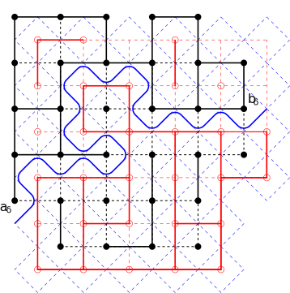{width=80%}
:::

::: {.column}

* Given $p\in [0,1],q\in (0,\infty).$
* $c(\omega)$: Number of dot lines.
* $o(\omega)$: Number of solid lines.
* $k(\omega)$: Number of components of solids lines.
* $\mathbf{P}(\omega)=C p^{o(\omega)} (1-p)^{c(\omega)} q^{k(\omega)}.$

:::
::::

## FK-Ising model 

:::: {.columns}
::: {.column}

{width=80%}

:::

::: {.column}

* Given $p\in [0,1],q\in (0,\infty).$
* $c(\omega)$: Number of dot lines.
* $o(\omega)$: Number of solid lines.
* $k(\omega)$: Number of components of solids lines.
* $\mathbf{P}(\omega)=C p^{o(\omega)} (1-p)^{c(\omega)} q^{k(\omega)}.$
* Critical FK-Ising model: $q=2,$ $p=\dfrac{\sqrt{q}}{1+\sqrt q}.$
  
Theorem. @smirnov2010conformal, @chelkak2014convergence
: Critical FK-Ising model $\implies$ $\operatorname{SLE}_{16/3}.$
  
:::
::::

## SLEs and discrete models

$\operatorname{SLE}$ | Models | Reference
:-------: | :-------: | -------:
$\operatorname{SLE}_{2}$ | (conditioned) Loop-erased random walk (LERW) | @lawler2004conformal, @zhan2008scaling, @bauer2009conditioning
Chordal $\operatorname{SLE}_{\frac{8}{3}}$ | Self-avoiding walk (SAW) | @lawler2002scaling (Conjecture)
Chordal $\operatorname{SLE}_{3}$ | Critical spin-Ising model | @chelkak2012universality, @chelkak2014convergence
Dipolar $\operatorname{SLE}_{3}$ | Ising model with plus-minus-free boundary conditions | @bauer2005dipolar, @hongler2013ising
Chordal $\operatorname{SLE}_{4}$ | Harmonic explorer (HE) | @schramm2005harmonic
Chordal $\operatorname{SLE}_{4}$ | Discrete Gaussian free field (DGFF) | @schramm2009contour
Chordal $\operatorname{SLE}_{\frac{16}{3}}$ | Critical FK-Ising model | @smirnov2010conformal, @chelkak2014convergence
Chordal $\operatorname{SLE}_{6}$ | Critical percolation exploration on the triangular lattice | @Smirnov2001CriticalPI, @camia2007critical
Chordal $\operatorname{SLE}_{8}$ | Uniform spanning tree (UST) Peano curve | @lawler2004conformal 

## Why conformal transformations?

:::: {.columns}
::: {.column width="75%"}

* Definition.
  : We say that $f:D\longrightarrow D'$ is a **conformal transformation** if $f$ is holomorphic, one-to-one, and onto.

* Conformal transformations =  Locally rotation + rescaling.

* 

* The conformal transforms $\color{red}{\text{keep the structures of two-dimensional lattice models.}}$

* Theorem.
  : Let $f$ be a non-constant entire function and let $(B_t)_{t\in [0,\infty)}$ be a planar Brownian motion.
    Then $\big(f(B_t)\big)_{t\in [0,\infty)}$ is a time-changed Brownian motion.

:::

::: {.column width="25%"}


:::
::::

## ⭐ Schramm Loewner Evolution (SLE)

* Schramm Loewner Evolution = Loewner differential equation + Brownian motion (with speed $\kappa$).
  
* Loewner differential equation are used to study the slit mappings.

:::: {.columns}
::: {.column width="30%"}

* Consider the Percolation with side length $\varepsilon$ in $\mathbb{H}$ for $\varepsilon$ small.

* Given the $\color{red}{\text{red parts}}$ in the right figure, say $\color{red}{\gamma.}$
Then it becomes the Percolation in $\mathbb{H}\backslash \gamma.$

:::

::: {.column width="70%"}


:::
::::

* Through physical observation, by conformal transformation $f,$
  \begin{align*}
    \begin{aligned}
    \text{Given } \color{red}{\gamma} \text{, percolation in }\mathbb{H}\backslash \gamma \, \iff \, \text{Percolation in }\mathbb{H}.
    \end{aligned}
  \end{align*}

* It is natural to consider the conformal transformation $f$ from $\mathbb{H}\backslash \gamma$ to $\mathbb{H}$ with
\begin{align*}
  \begin{aligned}
  \lim_{z\rightarrow \infty} \big[ f(z)-z \big] = 0,
  \end{aligned}
\end{align*}
where $\gamma$ is a simple curve. 

* This is the $\color{blue}{\text{Loewner differential equation}}.$

## ⭐ Loewner differential equation  ($\gamma(0,t]\implies U_t$)

:::: {.columns}
::: {.column width="55%"}

Proposition. 
:   * Let $\gamma(0,T]$ be a simple curve in $\mathbb{H}$ and $\gamma(0)\in\mathbb{R}.$ 
    * Let $g_t:\mathbb{H}\backslash \gamma(0,t]\longrightarrow \mathbb{H}$ be the unique conformal transformation such that 
      \begin{align*}
        \begin{aligned}
        g_t(z) = \color{blue}{z} + \frac{\color{blue}{2t}}{z} + \cdots , \quad z \rightarrow \infty.
        \end{aligned}
      \end{align*}
  
    Then 
    
    1. Fix any $t\in [0,T].$ The limit $\lim\limits_{z\rightarrow\gamma(t),z\in \mathbb{H}\backslash \gamma(0,t]} g_t(z)$ exists in $\mathbb{R},$ say, $\color{blue}{U_t}.$
      
    2. The map $t\mapsto U_t$ is continuous in $[0,T].$
    
    3. For $z\in \mathbb{H}\backslash \gamma(0,T],$ $\big(g_t(z)\big)_{t\in [0,T]}$ is the solution of the initial value problem
      \begin{align}
        \begin{aligned}
        \color{blue}{\partial_t z_t=\frac{2}{z_t-U_t},\quad z_0=z.}
        \end{aligned}
      \end{align}
      We call this ordinary differential equation the **(chordal) Loewner equation**.

:::

::: {.column width="45%"}

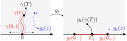


{width=50%}

* The point $\color{blue}{z=\gamma(t)}$ is the point eaten by $\color{red}{\gamma(s)}$ at time $t.$ 
* The $\color{blue}{\text{Loewner flow}}$ started from $\gamma(t)$ will stops when hitting $\mathbb{R}$ at time $t.$

* For each $z\in \mathbb{H}.$
  * Let $g_s(z)$ be the Loewner flow from the chordal Loewner equation.
  * $\tau(z):=\inf\big\lbrace t\in [0,T]: \inf_{s\in [0,t)} \left\vert g_s(z)-U_s \right\vert = 0 \big\rbrace.$
    * The life time of the Loewner flow $g_s(z).$
* $\gamma(0,t] = \big\lbrace z\in \mathbb{H}: \tau(z) \leq t \big\rbrace.$

* $(\gamma_t)_{t\in [0,T]}$ : Sticking the left and right sides of $(U_{T-t})_{t\in [0,T]}$ together.

:::
::::

## $\operatorname{SLE}_4$, and its Loewner flow.

:::: {.columns}
::: {.column width="60%"}

{width=95%}

:::

::: {.column width="40%"}

{width=95%}

* $(\gamma_t)_{t\in [0,T]}$: Sticking the left and right sides of $(U_{T-t})_{t\in [0,T]}$ together.

:::
::::

## ⭐ Loewner differential equation ($U_t \implies \gamma(0,t)$ or $K_t$)

:::: {.columns}
::: {.column}

* Conversely, given a continuous function $(U_t)_{t\geq 0}.$
* For $z\in \mathbb{H},$
let $g_t(z)$
be the solution of the initial value problem
\begin{align}
  \begin{aligned}
  \partial_t z_t=\frac{2}{z_t-U_t},\quad z_0=z.
  \end{aligned}
\end{align}
* Let $\tau(z):=\inf\big\lbrace t\in [0,\infty): \inf_{s\in [0,t)} \left\vert g_s(z)-U_s \right\vert = 0 \big\rbrace.$
* Let $K_t := \big\lbrace z\in \mathbb{H}: \tau(z)\leq t \big\rbrace.$
  * The point be eaten before time $t.$

Proposition.
:   * $K_t$ is an $\mathbb{H}$-hull. That is,
      $K_t$ is a bounded subset of $\mathbb{H}$ and $K_t$ is relatively closed in $\mathbb{H},$ and
      $\mathbb{H}\backslash K_t$ is simply connected.

    * The function $g_t$ restricted to $\mathbb{H}\backslash K_t$ is the unique conformal transformation from $(\mathbb{H}\backslash K_t,\infty)$ to $(\mathbb{H},\infty)$ with expansion
      \begin{align*}
        \begin{aligned}
        g_t(z) = z + \frac{2t}{z} + \cdots, \quad z\rightarrow \infty.
        \end{aligned}
      \end{align*}

* $(U_t)_t \iff (g_t)_t \iff (K_t)_t$ for $K_t$ is a simple curve.
* 1D function $\iff$ A curve (?) in 2D via conformal mapping.

:::

::: {.column}

* $U_t=t.$
  
  {width=49%}
  {width=49%} 

* $U_t=t^{1/2}.$
  
  {width=49%}
  {width=49%} 

* $U_t=t\sin(t/100).$
  
  {width=49%}
  {width=49%} 

* $U_t=t\sin(t/100)-2t^2.$
  
  {width=49%}
  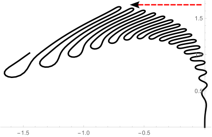{width=49%} 

:::
::::

## Is $(K_t)_{t\geq 0}$ a curve?

:::: {.columns}
::: {.column width="35%"}

{width=80%}

* $(K_t)_{t\in [0,T]}$: Sticking the left and right sides of $(U_{T-t})_{t\in [0,T]}$ together.
* $(U_t)_{t\geq 0}$ is called the $\color{blue}{\textbf{driving term}}$.
* If $(U_t)_{t\geq 0}$ has more oscillation intensity, 
  then the resulting $(K_t)_{t\geq 0}$ $\color{red}{\text{may not be a curve.}}$

:::

::: {.column width="65%"}

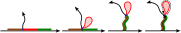

* Definition
  : Let $\big(\gamma(t)\big)_{t\geq 0}$ be a curve.
    We say that a Loewner chain $(g_t)_{t\geq 0}$ (or $(K_t)_{t\geq 0}$) $\color{blue}{\text{is generated by a curve }\gamma}$
    if $\mathbb{H}\backslash K_t$ is the unbounded component of $\mathbb{H}\backslash \gamma(0,t]$ for $t\in [0,\infty).$

* Let $\left\lVert U \right\rVert_{\alpha}$ be the Hölder-$\alpha$ norm.
  That is,
  \begin{align*}
    \begin{aligned}
    \left\lVert U \right\rVert_{\alpha} = \inf\big\lbrace c>0: \lvert U_t-U_s \rvert \leq c \lvert t-s \rvert^{\alpha},\, \forall s,t\in [0,\infty) \big\rbrace.
    \end{aligned}
  \end{align*}
* Theorem. @marshall2005loewner
  : $\exists$ $C_0>0$ such that $(K_t)_{t\geq 0}$ is generated by a curve $\gamma$
    if $\left\lVert U \right\rVert_{1/2}<C_0.$
    
      * If $\left\lVert U \right\rVert_{1/2}<\sqrt{2},$ then $\gamma$ is a simple curve.

* Theorem. @lind2005sharp
  : The maximal value for $C_0$ above is $4.$

* Next we see other type of the Loewner equation.

:::
::::

## Other Loewner differential equation 

:::: {.columns}
::: {.column}

### Radial Loewner differential equation

* $\mathbb{D}:= \big\lbrace x+iy\in \mathbb{C}: x^2+y^2<1 \big\rbrace.$
* Let $g_t$ be the unique conformal transformation from $\mathbb{D}\backslash \gamma(0,t]$ 
  to $\mathbb{D}$ with $g_t(0)=0,$ $g_t'(0)>0.$
* Then the Loewner differential equation becomes
  \begin{align*}
    \begin{aligned}
    \partial_t g_t(z) = g_t(z) \frac{U_t+g_t(z)}{U_t-g_t(z)},\quad g_0(z) = z,\quad z\in \mathbb{D}.
    \end{aligned}
  \end{align*}

{width=80%}

:::

::: {.column}

### Dipolar Loewner differential equation

* $\mathbb{S}:= \big\lbrace x+iy\in \mathbb{C}: x\in \mathbb{R}, y\in (0,\pi)\big\rbrace.$
* Let $g_t$ be the unique conformal transformation from $\mathbb{S}\backslash \gamma(0,t]$ 
  to $\mathbb{S},$ with $g(\pm \infty) = \pm \infty,$
  \begin{align*}
    \begin{aligned}
    -\lim_{z\rightarrow -\infty} \big( g_t(z) - z\big) = \lim_{z\rightarrow \infty} \big( g_t(z) - z\big).
    \end{aligned}
  \end{align*}
* Then the Loewner differential equation becomes
  \begin{align*}
    \begin{aligned}
    \partial_t g_t(z)=\coth\left(\frac{g_t(z)-U_t}{2}\right),\quad g_0(z) = z,\quad z\in \mathbb{S}
    \end{aligned}
  \end{align*}

{width=95%}


:::
::::

<hr />

* Next we see the definition of Schramm Loewner Evolution.

## ⭐ The definition of Schramm Loewner Evolution

:::: {.columns}
::: {.column width=60%}
Definition.
: The chordal $\operatorname{SLE}_\kappa$ is defined by $\mathbb{H}$-hulls $(K_t)_{t\geq 0}$
  which generated by 
  \begin{align*}
  \begin{aligned}
  \partial_t g_t(z)=\frac{2}{g_t(z)-U_t},\quad g_0(z) = z,\quad z\in \mathbb{H}
  \end{aligned}
  \end{align*}
  for $U_t=\sqrt{\kappa}B_t,$ where $B_t$ is a standard Brownian motion.
  We called the $\mathbb{H}$-hulls $(K_t)_{t\geq 0}$ the $\operatorname{SLE}_{\kappa}$-hull.

* Why $B_t?$

* Properties of $(K_t)_{t\geq 0}?$
  * Is $(K_t)_t$ a simple curve, or generated by a curve?
:::

::: {.column width=40%}
{width=80%}
:::
::::

## Why $B_t?$ ①

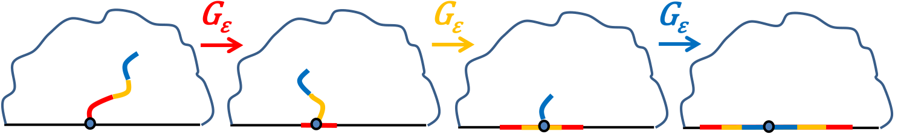

:::: {.columns}
::: {.column width="40%"}

* Given iid $G_{\varepsilon}:$
  \begin{align*}
    \begin{aligned}
    \color{red}{G_{\varepsilon}=U_{\varepsilon}+z+\frac{2\varepsilon}{z}+\cdots}, \cr 
    \color{orange}{G_{\varepsilon}=U_{\varepsilon}+z+\frac{2\varepsilon}{z}+\cdots}, \cr
    \color{blue}{G_{\varepsilon}=U_{\varepsilon}+z+\frac{2\varepsilon}{z}+\cdots}.
    \end{aligned}
  \end{align*}

:::

::: {.column width="60%"}

* Comcosition of iid $G_{\varepsilon}:$
  \begin{align*}
    \begin{aligned}
    \color{blue}{G_{\varepsilon}} \color{black}{\circ} \color{orange}{G_{\varepsilon}} \color{black}{\circ} \color{red}{G_{\varepsilon}} \color{black}= \color{blue}{U_{\varepsilon}}+\color{orange}{U_{\varepsilon}}+\color{red}{U_{\varepsilon}}+z+\frac{2\cdot 3\varepsilon }{z} + \cdots.
    \end{aligned}
  \end{align*}

* $\color{blue}{U_{\varepsilon}}+\color{orange}{U_{\varepsilon}}+\color{red}{U_{\varepsilon}}$ is a random walk, 
  hence we may consider $(U_t)_{t\geq 0}$ is a Brownian motion with some speed.

:::
::::

## Why $B_t?$ ②

:::: {.columns}
::: {.column width="50%"}

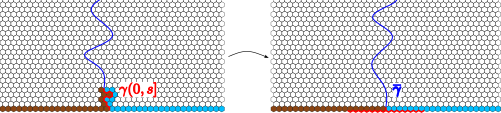

* Suppose we have a random curve $\gamma(0,\infty).$ (Consider the interface of percolation).
* Given $\gamma[0,s].$
 
* Let $\overline{\gamma}(t):= g_s\big( \gamma(t+s) \big) - g_s\big( \gamma(s) \big).$

* Let $\overline{g}_t$ be the Loewner chain of $\overline{\gamma}(0,t].$
  Then
\begin{align*}
  \begin{aligned}
  \overline{g}_t(z) &= g_{t+s}\circ g_s^{-1}(z+U_s) -U_s, \cr 
  \partial_t \overline{g}_t(z) &= \frac{2}{\overline{g}_t(z)-\overline U_t} , \quad \overline U_t=U_{s+t}-U_s.
  \end{aligned}
\end{align*}

* It is natural to consider that 

  1. $\overline{\gamma}[0,\infty)\stackrel{\operatorname{law}}{=}\gamma[0,\infty).$
  2. $\overline{\gamma}[0,\infty)$ and $\gamma[0,s]$ are independent.

:::

::: {.column width="50%"}

* Then on $(U_t)_{t\geq 0},$ it is

  1. $(U_{t+s}-U_s)_{t\geq 0}\stackrel{\operatorname{law}}{=}(U_t)_{t\geq 0}.$
  2. $(U_{t+s}-U_s)_{t\geq 0}$ and $(U_t)_{t\in [0,s]}$ are independent.

* Since $(U_t)_{t\geq 0}$ is continuous, we can write 
  $$U_t=\mu t + \sqrt{\kappa} B_t$$
  for some $\mu\in \mathbb{R}$ and $\kappa\in (0,\infty)$
  and for some $B$ a standard one dimensional Brownian motion.

* Since the law of $\gamma$ is invariant if we rotate around $y$-axis,
  we have 
  $$(U_t)_{t\geq 0}\stackrel{\operatorname{law}}{=}(-U_t)_{t\geq 0}$$
  which implies $\mu=0.$

:::
::::

<hr />

* Next we see some properties of SLE $(K_t)_{t\geq 0}.$

## ⭐ Properties of SLE

### $\operatorname{SLE}_{\kappa}$ has the following properties:
    
:::: {.columns}
::: {.column}

* Scaling invariance: $(K_t)_{t\geq 0}\stackrel{\operatorname{law}}{=}(\lambda^{-1} K_{\lambda^2 t})_{t\geq 0}.$
  * By the scaling invariance of Brownian motion: $(B_t)_{t\geq 0}\stackrel{\operatorname{law}}{=}(\lambda^{-1} B_{\lambda^2 t})_{t\geq 0}.$
  * Fractal?
* $(K_t)_{t\geq 0}$ is generated by a curve $(\gamma(t))_{t\geq 0}.$ ($\color{red}{\text{Hard!}}$)
  * Recall that w.p.1, $(B_t)_{t\in [0,1]}$ is not Hölder-$1/2$ continuous.
  * The terminal point $\gamma(\infty)$ of this curve?
    * With the terminal point, we may define SLE on other domains.
  * $(\gamma(t))_{t\geq 0}$ admits the phase transition.
  * Reversal of SLE trace $\gamma(0,\infty)$?
    * This can be observed from discrete models.
  * $\gamma(0,\infty)$ is a random fractal.

:::

::: {.column}

{width=60%}

:::
::::

## Properties of SLE (SLE is generated by a curve)

:::: {.columns}
::: {.column width="60%"}

* Theorem. @lawler2004conformal, @schramm2005basic
  : The $\operatorname{SLE}_{\kappa}$-hull $(K_t)_{t\geq 0}$ is generated by a curve $(\gamma(t))_{t\geq 0}.$

* Theorem. @schramm2005basic
  : 1. If $0\leq \kappa\leq 4,$ then w.p.1,
the curve $(\gamma(t))_{t\geq 0}$ is simple and $\gamma(0,\infty)\subset \mathbb{H};$
    1. If $4<\kappa<8,$ then w.p.1,
       for any $z\in \overline{\mathbb{H}}\backslash \lbrace 0 \rbrace$ we have $z\notin \gamma[0,\infty),$ 
        and 
        \begin{align*}
          \begin{aligned}
          \bigcup_{t>0}\overline{K_t} = \overline{\mathbb{H}}, \quad \gamma[0,\infty)\cap \mathbb{H}\neq \mathbb{H}.
          \end{aligned}
        \end{align*}
    1. If $\kappa\in [8,\infty),$ then $\gamma[0,\infty)=\overline{\mathbb{H}}$ a.s.

* 

  <!-- * Simulations due to Tom Kennedy. https://www.math.arizona.edu/~tgk/sle/ -->

* {width="100%"}

* Note that $\operatorname{SLE}_{\kappa}$ curve $(\gamma(t))_{t\geq 0}$ is the same as phase transitions (at $\kappa=4,8$).
* $\kappa\nearrow$ $\implies$ $\gamma$ becomes more fractal.

:::

::: {.column width="40%"}

$\kappa = 2,3,4,16/3,6,8.$

{width=45%}
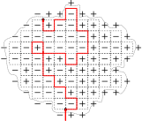{width=45%}
{width=45%}
{width=45%}
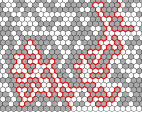{width=45%}
{width=45%}

:::
::::


## Properties of SLE (terminal points and reversity)

* We always focus on the random set $\gamma(0,\infty).$ (We only need to see the interface of model).
  This is called the $\operatorname{SLE}_{\kappa}$ trace.

### The terminal points of the $\operatorname{SLE}_{\kappa}$ traces

* For the chordal case, $\lim_{t\rightarrow\infty}\big\lvert \gamma(t) \big \rvert = \infty$ a.s. (@lawler2004conformal, @schramm2005basic).

:::: {.columns}
::: {.column width="60%"}

* Definition.
  : For any simply connected domain $D$ with two different prime ends $a,b,$
    we say $f(\gamma)$ is a $(D,a,b)$-chordal $\operatorname{SLE}_\kappa$ trace if
    * $\gamma$ is a chordal $\operatorname{SLE}_\kappa$ trace and 
    * $f$ is a conformal transformation from $(\mathbb{H},0,\infty)$ to $(D,a,b).$
    
:::

::: {.column width="40%"}


:::
::::

### The reversity of the $\operatorname{SLE}_{\kappa}$ traces

* Conjecture. @schramm2005basic 
  : The chordal $\operatorname{SLE}_{\kappa}$ trace is reversible for $\kappa\in [0,8].$
    * That is, given $(D,a,b),\, a,b\in \partial D,$ 
      if $\gamma_1$ is a $(D,a,b)$-chordal $\operatorname{SLE}_{\kappa}$ trace and
      $\gamma_2$ is a $(D,b,a)$-chordal $\operatorname{SLE}_{\kappa}$ trace,
      then $\gamma_1$ has the same law as $\gamma_2.$
    
  * This conjecture is proven in @zhan2008reversibility for $\kappa\in (0,4]$ and proven in @miller2016imaginary for $\kappa\in (4,8).$
  * This reversity fails for $\kappa>8.$ 


## Properties of SLE (SLE traces are random fractals)

:::: {.columns}
::: {.column}

* Conjecture. @mandelbrot1982fractal
  : Let $B$ be a planar Brownian motion. Then $\dim_{\mathbf{H}}(\partial B)=4/3$ a.s.

  * Mandelbrot observed this dimension by simulating the planar simple random walk loops 
    (simple random walks conditioned to begin and end at the same point).

  * This dimension $4/3$ is the same as the dimension (conjecture) of the scaling limit (if it exists) of the Self-avoiding walk (SAW).
    
  * This conjecture was proved by @lawler2011valuesII by using $\operatorname{SLE}_6.$

* Theorem. @beffara2008dimension
  : $\dim_{\mathbf{H}}(\operatorname{SLE}_{\kappa}) = \min\big\lbrace 2,1+\kappa/8\big\rbrace$ a.s.

  * For $\kappa\geq 8,$ $\dim=2.$

* Theorem. @zhan2008duality (Conjectured in @dubedat2005sle)
  : For $\kappa\in (4,\infty),$ $\partial(\operatorname{SLE}_{\kappa})=\operatorname{SLE}_{16/\kappa}.$

  * @Smirnov2001CriticalPI: $\dim_{\mathbf{H}}\big(\partial (\operatorname{SLE}_6)\big)=4/3.$
  * For $\kappa=6,$ $\partial(\operatorname{SLE}_{6})=\operatorname{SLE}_{8/3}.$
  
:::

::: {.column}

Theorem. @ConformalRestrictionAMS
:   * Let $(K_t)_{t\geq 0}$ be the chordal $\operatorname{SLE}_6$ hull and $T$ be the first time that $K_t$ intersects $\partial \mathbb{D}.$
    * Let $B$ be a reflected planar BM in $\mathbb{H}$ starting at $0$ 
    and reflected at an angle $\pi/3$ off $[0,\infty)$ and at an angle $2\pi/3$ off $(-\infty,0],$
    stopped on hitting $\partial \mathbb{D}.$ 
    * Let $X$ be the union of $B$ and all bounded components of $\mathbb{H}\backslash B.$

    * Then $K_T\stackrel{\operatorname{law}}{=}X.$

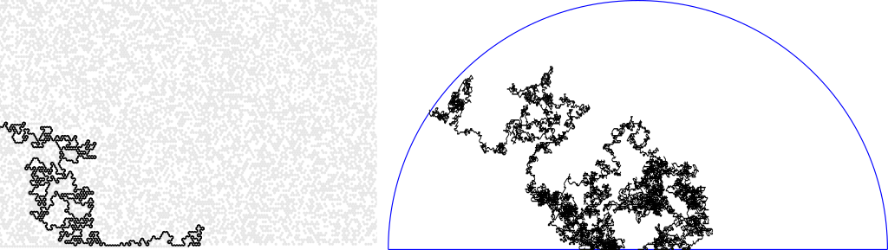

The reflected BM $B$ is defined as the follows:

* Let $u(x)=e^{i\pi/3}$ if $x\geq 0$ and $u(x)=e^{2i\pi/3}$ if $x<0.$
* Let $W$ be a planar BM started from $0.$

Then there exist a unique pair $(B_t,\ell_t)$ of continuous processes such that

* $B_t$ takes its values in $\overline{\mathbb{H}},$
* $\ell_t$ is a non-decreasing real-valued function with $\ell_0=0$ that increases only when $B_t\in \mathbb{R},$ and
* $B_t=W_t+\int_0^t u(B_s)\mathrm{d} \ell_s.$

:::
::::

## ⭐ Conformal restriction property

:::: {.columns}
::: {.column}
* $\mathcal{Q}^*:=\big\lbrace A : A\text{ is a }\mathbb{H}\text{-hull, }0\notin\overline{A}\,\big\rbrace.$

@ConformalRestrictionAMS
: Let $\gamma$ be a chordal $\operatorname{SLE}_{8/3}$ trace 
and let $A\in \mathcal{Q}^*.$
    Then
    \begin{align}
      \begin{aligned}
      \mathbf{P}\big[ \,\gamma[0,\infty)\cap A=\emptyset \, \big] = \Phi_A'(0)^{5/8},
      \end{aligned}
      \tag{⚡}
    \end{align}
    where $\Phi_A$ is the unique conformal transformation from $(\mathbb{H}\backslash A,0,\infty)$ to $(\mathbb{H},0,\infty)$ with $\Phi_A'(\infty)=1.$

:::

::: {.column}
* It is natural to see the conditional law of $\Phi_A(\gamma)$ given $\lbrace\gamma\cap A=\emptyset\rbrace.$

* By (⚡), $\forall A,A'\in \mathcal{Q}^*,$
\begin{align}
  \begin{aligned}
  \mathbf{P}\big[\Phi_{A}(\gamma) \cap A'=\emptyset \,\big\vert \, \gamma\cap A =\emptyset \big] 
  = \mathbf{P}\big[ \gamma \cap A'=\emptyset \big].
  \end{aligned}
\end{align}

* This says that conditioned on $\big\lbrace \gamma\cap A = \emptyset \big\rbrace,$ 
  * $\gamma$ will be a $(\mathbb{H}\backslash A,0,\infty)$-chordal $\operatorname{SLE}_{8/3}$ trace.
  * Or, $\Phi_A(\gamma)$ will be a $(\mathbb{H},0,\infty)$-chordal $\operatorname{SLE}_{8/3}$ trace.

We call this property the **conformal restriction property**.

:::
::::

<hr />

:::: {.columns}
::: {.column}

Conjecture.
: Infinite self-avoiding walk (SAW) $\implies$ $\operatorname{SLE}_{8/3}.$

* If the scaling limit of infinite SAW in the upper half plane $\color{red}{\text{exists}}$ and is $\color{red}{\text{conformally invariant}}$, 
  then it must be a chordal $\operatorname{SLE}_{8/3}.$

* SAW satisfies the restriction properties.

:::

::: {.column}


:::
::::

## ⭐ Dipolar SLE

:::: {.columns}
::: {.column}


Definition.
: The dipolar $\operatorname{SLE}_\kappa$ is defined by $\mathbb{S}$-hulls $(K_t)_{t\geq 0}$ 
  generated by 
  \begin{align*}
    \begin{aligned}
    \partial_t g_t(z)=\coth\left(\frac{g_t(z)-U_t}{2}\right),\quad g_0(z) = z,\quad z\in \mathbb{S}
    \end{aligned}
  \end{align*}
  for $U_t=\sqrt{\kappa}B_t,$ where $B_t$ is a standard Brownian motion.


* Dipolar $\operatorname{SLE}_{\kappa}$ behaves similarly to chordal $\operatorname{SLE}_{\kappa},$
  but not filling all space for $\kappa>4.$

:::

::: {.column}

### A relation between dipolar SLE and chordal SLE

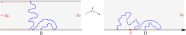

Given $x\in (-\infty,0)$ and let $f$ be the conformal transformation 
from $(\mathbb{S},0,\infty,-\infty)$ to $(\mathbb{H},0,\infty,x).$
Then 
\begin{align}
  \begin{aligned}
  f(\text{ dipolar }\operatorname{SLE}_{\kappa}\text{ trace}) \stackrel{\operatorname{law}}{=} K_{\tau},
  \end{aligned}
\end{align}
where $(K_t)_{t\geq 0}$ is the $\mathbb{H}$-hulls generated by the 
$\color{red}{\text{chordal Loewner equation}}$ 
with driving term $(U_t)_{t\geq 0}$ satisfies, with $\rho = (\kappa-6)/2,$
\begin{align}
  \begin{cases}
  \begin{aligned}
  \mathrm{d} U_t &= \frac{\rho} {U_t-V_t} \mathrm{d} t + 
  \sqrt{\kappa} \mathrm{d} B_t  \cr 
  \mathrm{d} V_t &= \frac{2}{V_t-U_t} \mathrm{d} t , \cr 
  U_0 &= 0, \quad  V_0= x , \quad \frac{U_t-V_t}{U_0-V_0}>0,
  \end{aligned}
  \end{cases}
\end{align}
and $\tau$ is the first time that $(K_t)_{t\geq 0}$ hits $(-\infty,x]$ (first time eat $x$).

* The solution $(U_t,V_t)$ can be constructed by a Bessel process with parameter $(\rho+2)/\kappa$:
\begin{align*}
  \begin{aligned}
  \mathrm{d} Z_t &= \frac{\rho+2}{Z_t} \mathrm{d} t + \sqrt{\kappa} \mathrm{d} B_t , &   Z_0 &= -x; \cr 
  \mathrm{d} V_t &= \frac{-2}{Z_t} \mathrm{d} t  , &   V_0 &= x; \cr 
  U_t &= Z_t + V_t.   
  \end{aligned}
\end{align*}

:::
::::

## Brownian loop

:::: {.columns}
::: {.column width=70%}

* Recall that Mandelbrot's conjecture is by simulating the planar simple random walk loops 
  (simple random walks conditioned to begin and end at the same point).
* It is natural to consider the loops generated by the planar BM.
* Let $\mu(z,\cdot;t)$ be the law of $(B_s)_{0\leq s\leq t}$ where $B$ is a planar BM  with $B_0=z.$
* We can write $\mu(z,\cdot ; t) = \int_{\mathbb{C}}\mu(z,w;t)\mathrm{d} A(w)$
  and let $\mu^{\#}(z,w;t)=\mu(z,w;t)/\vert \mu(z,w;t) \vert .$
* If $\gamma$ is a continuous planar curves defined on a time interval $[0,t_{\gamma}]$
  with $\gamma(0)=\gamma(t_{\gamma}).$
  Then $\ell=\gamma[0,t_{\gamma})$ is an unrooted loop.
* The unrooted loop measure is defined by
  \begin{align*}
    \begin{aligned}
    \mu^{\operatorname{loop}} \big\lbrace \ell \in \cdot \big\rbrace = \int_{\mathbb{C}}\int_0^{\infty} \frac{1}{2\pi t^2} \mu^{\#} (z,z;t)\big\lbrace \gamma(0)=\gamma(t_{\gamma}),\gamma(0,t_{\gamma})\in \cdot \big\rbrace \mathrm{d} t \mathrm{d} A(z)
    \end{aligned}
  \end{align*}
  and $\mu^{\operatorname{loop}}_D$ is $\mu^{\operatorname{loop}}$ restricted to loops staying in $D.$
* The unrooted loop measure $\big\lbrace \mu_D^{\operatorname{loop}} \big\rbrace_D$ satisfy the conformal invariance.


:::

::: {.column}

:::
::::

## ⭐ Results

:::: {.columns}
::: {.column width=45%}

* In @kang2013conformal, they use conformal field theory to 
show the conformal restriction property of dipolar $\operatorname{SLE}_{8/3}.$

Theorem. @kang2013conformal
: Let $\gamma$ be a dipolar $\operatorname{SLE}_{8/3}.$
Let $A$ be a $\mathbb{S}$-hull with $0\notin \overline{A}.$
Then
\begin{align}
  \begin{aligned}
  \mathbf{P}\big\lbrace \gamma\cap A=\emptyset \big\rbrace = g_A'(0)^{5/8} \exp\left\lbrace -\frac{5}{48} \operatorname{scap}(A) \right\rbrace.
  \end{aligned}
\end{align}
where $g_A$ is the unique conformal transformation from $(\mathbb{S}\backslash A,-\infty,\infty)$ to $(\mathbb{S},-\infty,\infty)$ such that there exists a unique value $s\in [0,\infty)$ satisfies
\begin{align*}
  \begin{aligned}
  \lim_{z\rightarrow\pm\infty}\big(g_A(z)-z\big)=\pm s.
  \end{aligned}
\end{align*}
The value $\operatorname{scap}(A)$ is defined by this unique value $s.$

* We give a generalization of this.

:::

::: {.column width=55%}

Theorem. 
: Let $\kappa\in (0,8/3].$
  Let $A$ be a $\mathbb{S}$-hull with $0\notin \overline{A}.$
  Then the Radon-Nikodym derivative of $(\mathbb{S}\backslash A,0,\mathbb{R}_\pi)$-dipolar $\operatorname{SLE}_{\kappa}$
  with respect to $(\mathbb{S},0,\mathbb{R}_\pi)$-dipolar $\operatorname{SLE}_{\kappa}$ is
  \begin{align*}
    \begin{aligned}
    & 1_{[\gamma\subset \mathbb{S}\backslash A]} 
    g_{A}'(0)^{-\alpha}\exp\big(c\operatorname{scap} (A)\big)  \cr 
    &\quad \cdot  \exp\left\lbrace -\frac{\lambda}{2} \mu_{\mathbb{S}}^{\operatorname{loop}} \Big\lbrace\ell \cap \gamma \neq \emptyset , \ell \cap A \neq \emptyset \Big\rbrace \right\rbrace,
    \end{aligned}
  \end{align*}
  where
  \begin{align*}
    \begin{aligned}
    (\alpha,c,\lambda) =\left(\frac{6-\kappa}{2\kappa},\frac{(\kappa-2)(6-\kappa)}{8\kappa}, \frac{(3\kappa-8)(\kappa-6)}{2\kappa} \right).
    \end{aligned}
  \end{align*}

* Note that for $\kappa = 8/3,$ 
  this Radon-Nikodym derivative becomes 
  $$1_{[\gamma\subset \mathbb{S}\backslash A]} g_A'(0)^{-5/8}\exp\Big\lbrace \frac{5}{48} \operatorname{scap}(A) \Big\rbrace.$$


:::
::::
 

## ⭐ Some problems

### SLE with initial distribution $U_0$? (This problem is from the reverse of a dipolar SLE).

* Need to study the Bessel process with initial distribution.
* For $\kappa=2,$ in @bauer2009conditioning, we have 
  
    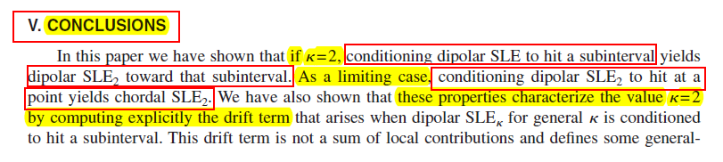


## ⭐ Some problems

### $\operatorname{SLE}_1$?

* The density (without normalization) of the terminal point of the $(\mathbb{H},\infty,[-1,1])$-dipolar $\operatorname{SLE}_{\kappa}$ trace on $[-1,1]$ are as follows.

{width=70%}


## ⭐ Some problems

### Radial decomposition for $\operatorname{SLE}_{8/3}$?

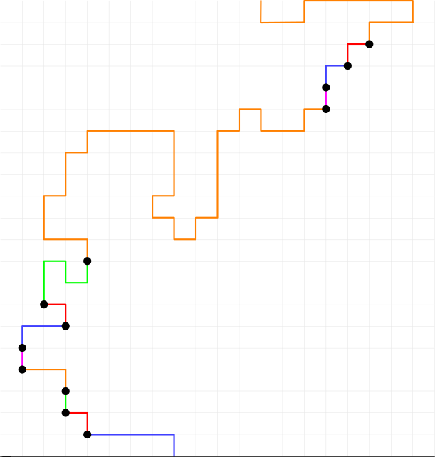{width=32%}
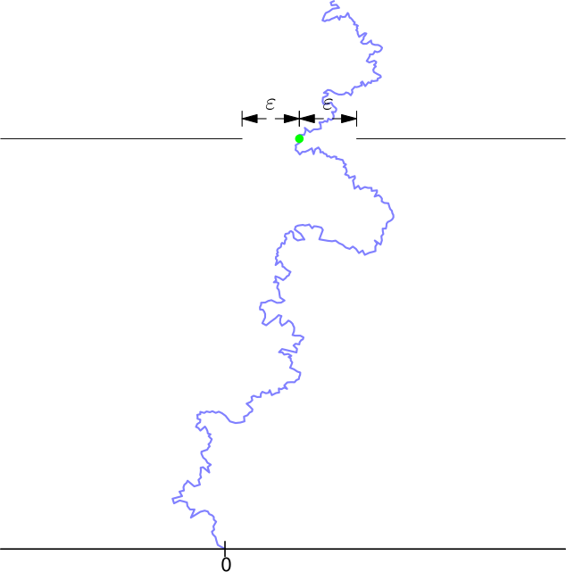{width=33%}
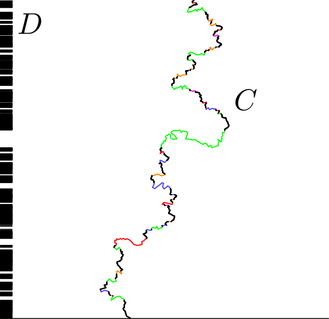{width=32%}

## ⭐ Some problems

### $U_t=K_t?$

:::: {.columns}
::: {.column}
* $U_t=t.$
  
  {width=49%}
  {width=49%} 
:::

::: {.column}

* $U_t=t^{1/2}.$
  
  {width=49%}
  {width=49%} 
:::
::::

## Reference