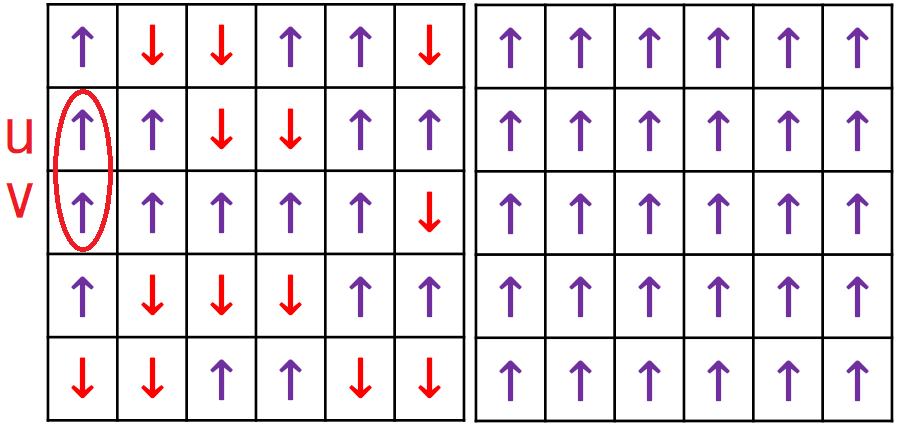
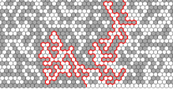
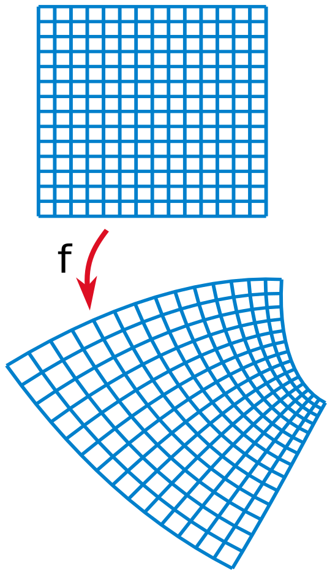
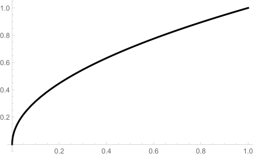
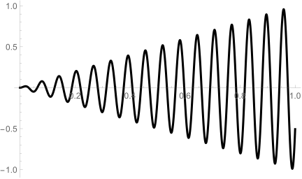
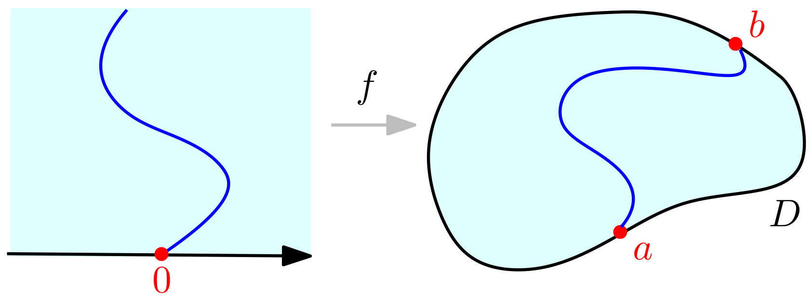
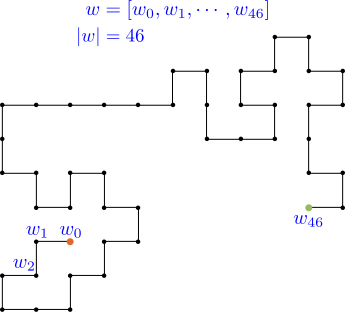
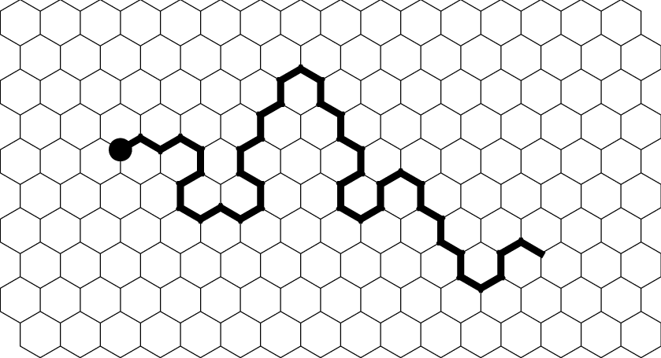

```{r setup, include=FALSE}
knitr::opts_chunk$set(echo = FALSE, warning = FALSE, message = FALSE)
```


## ⭐ Content

* Motivation

* Schramm-Loewner Evolution (SLE)
  * Loewner Differential Equation
  * Chordal SLE
  * Dipolar SLE

* Restriction Property  
  * Self-Avoiding Walk (SAW)
  * Brownian Loop 

* Results
  * Sketch of the Proof

## ⭐ Motivation: Ising Model

:::: {.columns}
::: {.column width=70%}

* Ising model: To study ferromagnetism.

* Let $V$ be all boxes of the square and $w=(w_v)_{v\in V}\in \lbrace \pm1 \rbrace^V.$

* We set a probability mass function by 
  \begin{align*}
    \mathbf{P}\big(\lbrace \omega\rbrace\big) = C \exp\Big( \frac{1}{T} \sum_{u\sim v}w_u w_v \Big),
  \end{align*}
  where the summation is over all neighbor pairs in $V$ and $C$ is a normalization constant.
  * $T$ is the temperature of this model.
  * $w_u w_v=1\iff$ $u$ and $v$ is an agreeing neighbor pair.

* This is a good model for describing ferromagnetism.
  * When the temperature over some critical value (Curie point), 
    the magnetization of the ferromagnetic material vanishes.
  * Critical temperature?

* Theorem. @kramers1941statistics
  : The critical inverse temperature $\dfrac{1}{T_c}=\dfrac{1}{2}\log(1+\sqrt 2).$

:::

::: {.column width=30%}

{width=90%}

:::
::::

## ⭐ Motivation: Ising Model

:::: {.columns}
::: {.column width="40%"}

* {width=100%}

* The Ising model from the chaotic state to the critical case.
  * 

:::

::: {.column width="60%"}

* To simplify the question, 
  we always consider the $+,-$ boundary conditions 
  and see the $\color{red}{\text{interface(交界)}}$.
  
* {width=50%}
  {width=35%}

* This is why we $\color{red}{\text{always consider the critical case}}$.

* When $\delta$ is small, 
  the interface of $+,-$ spins for the critical case looks like a random fractal curve.

* Theorem. @chelkak2012universality, @chelkak2014convergence
  : The critical Ising interface $\implies$ $\operatorname{SLE}_3.$

:::
::::

## Percolation (滲流理論)

* Critical percolation: Coloring each hexagons independently by $\mathbf{P}[\text{black}]=\mathbf{P}[\text{white}]=1/2.$

{width=36%}
{width=36%} 
{width=20%}

* Theorem. @schramm2000scaling, @Smirnov2001CriticalPI, @camia2007critical
  : The interface of the critical percolation on the hexagons $\implies$ $\operatorname{SLE}_6.$


<hr style='height:2px;border-width:0;color:gray;background-color:gray'>

:::: {.columns}
::: {.column width=70%}

* Schramm-Loewner Evolution (SLE, with a parameter $\kappa$): To describe the $\color{red}{\textbf{limit}}$ of the two-dimensional lattice models in statistical physics in the critical case.

* Next we see the conformal transformations.
  
:::

::: {.column width=30%}

:::
::::

## Why conformal transformations?

:::: {.columns}
::: {.column width="65%"}

* Definition.
  : We say that $f:D\longrightarrow D'$ is a **conformal transformation** if $f$ is holomorphic, one-to-one, and onto.

* Conformal transformations =  Local rotation + rescaling.

* 

* The conformal transforms keep the structures of two-dimensional lattice models
  and the planar BM.

:::

::: {.column width="35%"}

{width=80%}

:::
::::

## ⭐ Schramm-Loewner Evolution (SLE)

* Schramm-Loewner Evolution = Loewner differential equation + BM (with speed $\kappa$).
  
* Loewner differential equation are used to study the slit mappings.

:::: {.columns}
::: {.column width="30%"}

* Consider the percolation with side length $\varepsilon$ in $\mathbb{H}$ for $\varepsilon$ small.

* Given the $\color{red}{\text{red parts}}$ in the right figure, say $\color{red}{\gamma.}$
Then it becomes the percolation in $\mathbb{H}\backslash \gamma.$

:::

::: {.column width="70%"}


:::
::::

* Through physical observation, by conformal transformation $f,$
  \begin{align*}
    \begin{aligned}
    \text{given } \color{red}{\gamma} \text{, percolation in }\mathbb{H}\backslash \color{red}{\gamma} \, \iff \, \text{percolation in }\mathbb{H}.
    \end{aligned}
  \end{align*}

* It is natural to consider the conformal transformation $f$ from $\mathbb{H}\backslash \gamma$ to $\mathbb{H}$ with
\begin{align*}
  \begin{aligned}
  \lim_{z\rightarrow \infty} \big[ f(z)-z \big] = 0,
  \end{aligned}
\end{align*}
where $\gamma$ is a simple curve. 

## ⭐ Loewner Differential Equation  ($\gamma(0,t]\implies U_t$)

:::: {.columns}
::: {.column}

* Let $\gamma(0,T]$ be a simple curve in $\mathbb{H}$ and $\gamma(0)=0.$ 
* Let $g_t:\mathbb{H}\backslash \gamma(0,t]\longrightarrow \mathbb{H}$ be the $\color{blue}{\text{unique}}$ 
  conformal transformation such that 
  \begin{align*}
    \begin{aligned}
    g_t(z) = \color{blue}{z} + \frac{\color{blue}{2t}}{z} + \cdots , \quad z \rightarrow \infty.
    \end{aligned}
  \end{align*}

{width=95%}

:::
::: {.column}

* $(U_t)_{t\in [0,T]}$ is continuous.

Proposition. 
: For $z\in \mathbb{H}\backslash \gamma(0,T],$ $\big(g_t(z)\big)_{t\in [0,T]}$ is the solution of the initial value problem
  \begin{align}
    \begin{aligned}
    \color{blue}{\partial_t z_t=\frac{2}{z_t-U_t},\quad z_0=z.}
    \end{aligned}
    \tag{🌙}
  \end{align}
  We call this ordinary differential equation the **(chordal) Loewner equation**.

:::
::::

<hr style='height:2px;border-width:0;color:gray;background-color:gray'>

:::: {.columns}
::: {.column}

* For each $z\in \mathbb{H}.$
  * Let $g_s(z)$ be the Loewner flow from the chordal Loewner equation (🌙).
  * Let $\tau(z)$ be the supremum of all $t$ such that the solution is well defined up to time $t$ with $g_t(z) \in \mathbb{H}.$

:::
::: {.column}

* Then $\gamma(0,t] = \big\lbrace z\in \mathbb{H}: \tau(z) \leq t \big\rbrace.$
* $(\gamma_t)_{t\in [0,T]}$ : Sticking the left and right sides of $(U_{T-t})_{t\in [0,T]}$ together.

:::
::::


## Loewner flow, and its inverse.

:::: {.columns}
::: {.column}

{width=94%}

:::

::: {.column}

{width=94%}

* $(\gamma_t)_{t\in [0,T]}$: Sticking the left and right sides of $(U_{T-t})_{t\in [0,T]}$ together.

* Conversely, given a continuous function $(U_t)_{t\geq 0},$
  we can generate the set $\big\lbrace z\in \mathbb{H}: \tau(z) \leq t \big\rbrace$ like $(\gamma_t)_{t\in [0,T]}.$

:::
::::


## ⭐ Loewner Differential Equation ($U_t \implies \gamma(0,t)$ or $K_t$)

:::: {.columns}
::: {.column}

* Conversely, given a continuous function $(U_t)_{t\geq 0}.$
* For $z\in \mathbb{H},$
let $g_t(z)$
be the solution of the initial value problem
\begin{align}
  \begin{aligned}
  \partial_t z_t=\frac{2}{z_t-U_t},\quad z_0=z.
  \end{aligned}
\end{align}
* Let $\tau(z)$ be the supremum of all $t$ such that the solution is well defined up to time $t$ with $g_t(z) \in \mathbb{H}.$
* Let $K_t := \bigl\lbrace z\in \mathbb{H}: \tau(z)\leq t \bigr\rbrace.$

Proposition.
:   * $K_t$ is an $\mathbb{H}$-hull (may not a curve).
      That is,
      $K_t$ is a bounded subset of $\mathbb{H}$ and $K_t$ is relatively closed in $\mathbb{H},$ and
      $\mathbb{H}\backslash K_t$ is simply connected.

    * The function $g_t$ restricted to $\mathbb{H}\backslash K_t$ is the unique conformal transformation from $(\mathbb{H}\backslash K_t,\infty)$ to $(\mathbb{H},\infty)$ with expansion
      \begin{align*}
        \begin{aligned}
        g_t(z) = z + \frac{2t}{z} + \cdots, \quad z\rightarrow \infty.
        \end{aligned}
      \end{align*}


:::

::: {.column}

* $U_t=t.$
  
  {width=49%}
  {width=49%} 

* $U_t=t^{1/2}.$
  
  {width=49%}
  {width=49%} 

* $U_t=t\sin(t/100).$
  
  {width=49%}
  {width=49%} 

* $U_t=t\sin(t/100)-2t^2.$
  
  {width=49%}
  {width=49%} 

:::
::::


## ⭐ The Definition of SLE

:::: {.columns}
::: {.column width=65%}

* Definition.
  : The chordal $\operatorname{SLE}_\kappa$ is defined by $\mathbb{H}$-hulls $(K_t)_{t\geq 0}$
    which generated by 
    \begin{align*}
    \begin{aligned}
    \partial_t g_t(z)=\frac{2}{g_t(z)-U_t},\quad g_0(z) = z,\quad z\in \mathbb{H}
    \end{aligned}
    \end{align*}
    for $U_t=\sqrt{\kappa}B_t,$ where $B_t$ is a standard Brownian motion.
    We called the $\mathbb{H}$-hulls $(K_t)_{t\geq 0}$ the $\operatorname{SLE}_{\kappa}$-hull.

:::
::: {.column width=35%}
{width=80%}
:::
::::

* $(K_t)_{t\geq 0}$ has the scaling invariance: $(K_t)_{t\geq 0}\stackrel{\operatorname{law}}{=}(\lambda^{-1} K_{\lambda^2 t})_{t\geq 0}.$
  * By the scaling invariance of Brownian motion: $(B_t)_{t\geq 0}\stackrel{\operatorname{law}}{=}(\lambda^{-1} B_{\lambda^2 t})_{t\geq 0}.$


## Properties of SLE (SLE is generated by a curve)

:::: {.columns}
::: {.column}

* Theorem. @schramm2005basic
  : The $\operatorname{SLE}_{\kappa}$-hull $(K_t)_{t\geq 0}$ is generated by a curve $(\gamma(t))_{t\geq 0}$ a.s.

* 

* Theorem. @schramm2005basic
  : 1. If $0\leq \kappa\leq 4,$ then w.p.1, $\gamma$ is simple curve in $\mathbb{H};$
    1. If $4<\kappa<8,$ then w.p.1,
       all points of $\overline{\mathbb{H}}$ are swallowed by $\gamma(0,t)$ and $(K_t)_{t\geq 0}$ fills all $\mathbb{H}.$
    2. If $\kappa\in [8,\infty),$ then w.p.1, $\gamma[0,\infty)=\overline{\mathbb{H}}.$

* 


:::

::: {.column}

* Note that $\operatorname{SLE}_{\kappa}$ curve $(\gamma(t))_{t\geq 0}$ 
  * non-selfcrossing for all $\kappa$;
  * "phase transitions" at $\kappa=4,8.$
* $\kappa = 3,4.$

  {width=45%}
  {width=45%}

* $\kappa = 6,8.$
  
  {width=45%}
  {width=45%}

:::
::::


## Properties of SLE (Terminal points of SLE curves)

:::: {.columns}
::: {.column width="60%"}

* Proposition. @schramm2005basic
  : For the chordal $\operatorname{SLE}_{\kappa},$ $\lim_{t\rightarrow\infty}\big\lvert \gamma(t) \big \rvert = \infty$ a.s.

:::
::: {.column width="40%"}

:::
::::

:::: {.columns}
::: {.column width="60%"}

* We always focus on the random set $\gamma(0,\infty).$ 
  This is called the $\operatorname{SLE}_{\kappa}$ trace.
  * We only need to see the interface of the model.

* For any simply connected domain $D$ with $a,b\in \partial D,$
  we may define $(D,a,b)$-chordal $\operatorname{SLE}_\kappa$ trace by the conformal transformation
  from $(\mathbb{H},0,\infty)$ to $(D,a,b).$
    
:::

::: {.column width="40%"}

* 

:::
::::

<hr style='height:2px;border-width:0;color:gray;background-color:gray'>

:::: {.columns}
::: {.column width=80%}

* Hence, $\bigl\lbrace(D,a,b)$-chordal $\operatorname{SLE}_{\kappa}$ trace$\bigr\rbrace_{(D,a,b)}$ is a family of $\color{blue}{\text{non-selfcrossing}}$ traces satisfying the conformal invariance.
  * What is the relationship between plane BM $B$ and SLE?
  * $\partial B$?

:::

::: {.column width=20%}

:::
::::


## Properties of SLE (SLE traces are random fractals)

:::: {.columns}
::: {.column}

* Conjecture. @mandelbrot1982fractal
  : Let $B$ be a planar BM. Then $\dim_{\mathbf{H}}(\partial B)=4/3$ a.s.

  * This conjecture was proved by @lawler2011valuesII by using $\operatorname{SLE}_6.$

* @ConformalRestrictionAMS proved that 
  $$\partial\operatorname{SLE}_{6}=\partial B,$$
  where $B$ be a reflected planar BM in $\mathbb{H}$ starting at $0.$ 
  * (Reflected at an angle $\pi/3$ off $[0,\infty)$ and at an angle $2\pi/3$ off $(-\infty,0].$)

* 

:::

::: {.column}

* Theorem. @beffara2008dimension
  : $\dim_{\mathbf{H}}(\operatorname{SLE}_{\kappa}) = \min\big\lbrace 2,1+\kappa/8\big\rbrace$ a.s.

  * For $\kappa\geq 8,$ $\dim_{\mathbf{H}}(\operatorname{SLE}_{\kappa})=2.$

* Theorem. @zhan2008duality
  : For $\kappa\in (4,\infty),$ $\partial(\operatorname{SLE}_{\kappa})=\operatorname{SLE}_{16/\kappa}.$

  * @Smirnov2001CriticalPI: $\dim_{\mathbf{H}}\big(\partial (\operatorname{SLE}_6)\big)=4/3.$
  * For $\kappa=6,$ $\partial(\operatorname{SLE}_{6})=\operatorname{SLE}_{8/3}.$

:::
::::


## ⭐ Dipolar SLE

:::: {.columns}
::: {.column width=60%}


* $\mathbb{S}:=\bigl\lbrace x+iy\in \mathbb{C} : x\in \mathbb{R}, y\in (0,\pi)\bigr\rbrace.$

Definition.
: The dipolar $\operatorname{SLE}_\kappa$ is defined by $\mathbb{S}$-hulls $(K_t)_{t\geq 0}$ 
  generated by 
  \begin{align*}
    \begin{aligned}
    \partial_t g_t(z)=\coth\left(\frac{g_t(z)-U_t}{2}\right),\,\, g_0(z) = z,
    \end{aligned}
  \end{align*}
  for $U_t=\sqrt{\kappa}B_t,$ where $B_t$ is a standard Brownian motion.

{width=90%}

:::

::: {.column width=40%}

* Dipolar $\operatorname{SLE}_{\kappa}$ behaves similarly to chordal $\operatorname{SLE}_{\kappa}.$
  * Generated by a curve;
  * 
  * With a random terminal point in $\mathbb{R}+i\pi;$
  * Do not filling all space for $\kappa>4.$

* Similarly, we may define the Dipolar $\operatorname{SLE}_{\kappa}$ in $D$ from $x$ to $I$ 
  by the conformal transformation from $(\mathbb{S},0,\mathbb{R}+i\pi)$ to $(D,x,I).$

:::
::::


## ⭐ Restriction Property: Self-Avoiding Walk (SAW)

:::: {.columns}
::: {.column}

* A self-avoiding walk (SAW) $\color{blue}{w}$ of length $46$ in $\mathbb{Z}^2.$

* 

:::

::: {.column}

* SAW is used to describe the Polymer(聚合物) based on a carbon chain $$C-C-C-\cdots-C.$$
  * 2 carbon atoms (碳原子) cannot exist at the same location.
  * 

:::
::::


## SAW: Definition

:::: {.columns}
::: {.column}

* Let $\operatorname{SAW}^{\mathbf{0}}(n)$ be the set of all SAWs $w$ with $w_0=\mathbf{0}, \lvert w\rvert=n$ 
  and let $\operatorname{SAW}^{\mathbf{0}}=\bigcup_{n\in \mathbb{N}} \operatorname{SAW}^{\mathbf{0}}(n).$

* Let $C_n=\# \operatorname{SAW}^{\mathbf{0}}(n).$
  Then there exists a $\beta\in(0,\infty)$
  called the $\color{blue}{\text{connective}}$ $\color{blue}{\text{constant}}$ such that $$C_n \approx \beta^n.$$

* Let $\mu^{\operatorname{SAW}}(\mathbf{0})$ be the measure on $\operatorname{SAW}^{\mathbf{0}}$ by 
  \begin{align*}
    \begin{aligned}
    \mu^{\operatorname{SAW}}(\mathbf{0})\bigl\lbrace w \bigr\rbrace=\beta^{-\left\lvert w \right\rvert}.
    \end{aligned}
  \end{align*}

  * <rmk>If we assign $\mu^{\operatorname{SAW}}(\mathbf{0})\bigl\lbrace w \bigr\rbrace=e^{-\alpha\left\lvert w \right\rvert},$
    then we have a "phase transition" at $e^{-\alpha}=\beta^{-1}$ from a finite measure to an infinite measure.
    </rmk>

:::

::: {.column}

* The exact value of $\beta$ is unknown and depends on the lattice (non-universal).
  * $\beta\in (2.6,2.7).$
  * For SAWs defined on the honeycomb lattice, it has been proved by @duminil2012connective that 
    \begin{align*}
      \begin{aligned}
      \beta = \sqrt{2+\sqrt{2}} = 2\cos(\pi/8).
      \end{aligned}
    \end{align*}
  * 

:::
::::


## SAW: Some Critical Exponents

:::: {.columns}
::: {.column}

* (Conjecture) Mean-square displacement exponent $\nu$:
  \begin{align*}
    \begin{aligned}
    \frac{1}{C_n}\sum_{w\in \operatorname{SAW}^{\mathbf{0}}(n)} \operatorname{diam} (w) \approx n^{\nu}, \cr 
    \end{aligned}
  \end{align*}
  or,
  \begin{align*}
    \begin{aligned}
    \frac{1}{C_n} \sum_{w\in \operatorname{SAW}^{\mathbf{0}}(n)} \bigl\lvert w(n) \bigr\rvert^{2} \approx n^{2\nu}.
    \end{aligned}
  \end{align*}
  * This gives that the dimension of the paths of the scaling limit of SAWs (if it exists) should be $1/\nu.$

* (Conjecture) Number of walks exponent $\gamma$:
  \begin{align*}
    \begin{aligned}
    \mu^{\operatorname{SAW}}(0)\bigl\lbrace \operatorname{SAW}^{\mathbf{0}}(n) \bigr\rbrace = \beta^{-n} C_n \approx n^{\gamma-1}.
    \end{aligned}
  \end{align*}
  * The probability that two $\operatorname{SAW}^{\mathbf{0}}(n)$ do not intersect is
    \begin{align*}
      \begin{aligned}
      \frac{C_{2n}}{C_nC_n} \approx n^{1-\gamma}.
      \end{aligned}
    \end{align*}
  * {width=100%}

:::

::: {.column}

* Conjecture. 
  : $\nu,\gamma$ are universal (do not depend on the lattice).

* Conjecture.
  : $\nu=3/4,\gamma=43/32.$

* Conjecture.
  : SAW $\implies$ $\operatorname{SLE}_{8/3}.$

* {width=100%}

:::
::::


## ⭐ Restriction Property

:::: {.columns}
::: {.column width=80%}

* We may use a limit argument to define 
  $\mu^{\operatorname{SAW}}_D(z,w)$ for $z,w\in \partial D,$ which means that the law of SAWs from $z$ to $w$ in $D.$

* $\bigl\lbrace \mu_D^{\operatorname{SAW}}(z,w) \bigr\rbrace_D$ satisfies the **restriction property**:
  
  > If $D'\subset D,$ then
  $\mu_{D'}^{\operatorname{SAW}}(z,w)$ is $\mu_{D}^{\operatorname{SAW}}(z,w)$ restricted to walks that stay in $D'.$

* If the scaling limit of SAWs exists and is conformally invariant, 
  then it should be an $\operatorname{SLE}_{\kappa_0}$ for some $\kappa_0.$

* Let $\mu^{\operatorname{SLE}_{\kappa_0}}_D(z,w)$ be the law of a chordal $\operatorname{SLE}_{\kappa_0}$ in $D$ from $z$ to $w.$ 
  Then the following statement should holds: 
  
  > Let $A$ be an $\mathbb{H}$-hull with $0\notin \overline{A}.$ Then
    \begin{align*}
      \begin{aligned}
      \mu_{\mathbb{H}}^{\operatorname{SLE}_{\kappa_0}}(0,\infty) \bigg\vert _{\gamma\cap A=\emptyset} = c_A \cdot \mu_{\mathbb{H}\backslash A}^{\operatorname{SLE}_{\kappa_0}}(0,\infty)
      \end{aligned}
    \end{align*}
  for some constant $c_A,$ which is the ratio of the normalization constants of the scaling limits.

* Taking both measures on $\bigl\lbrace \gamma: \gamma\cap A = \emptyset\bigr\rbrace,$ we have
  \begin{align}
    \begin{aligned}
    \mathbf{P}\bigl\lbrace \operatorname{SLE}_{\kappa_0} \cap A = \emptyset \bigr\rbrace = c_A.
    \end{aligned}
    \tag{⚡}
  \end{align}

:::

::: {.column width=20%}

:::
::::


## ⭐ Restriction Property 

:::: {.columns}
::: {.column width=80%}


* Hence,
  \begin{align*}
    \begin{aligned}
    \mu_{\mathbb{H}}^{\operatorname{SLE}_{\kappa_0}}(0,\infty) \bigl[\,  \cdot \, \big\vert \gamma\cap A=\emptyset \bigr] = \mu_{\mathbb{H}\backslash A}^{\operatorname{SLE}_{\kappa_0}}(0,\infty).
    \end{aligned}
  \end{align*}

* For the value $c_A,$ we have the following:

  (Restriction). @ConformalRestrictionAMS
  : Let $\gamma$ be a chordal $\operatorname{SLE}_{8/3}$ trace 
  and let $A$ be an $\mathbb{H}$-hull with $0\notin \overline{A}.$
      Then
      \begin{align}
        \begin{aligned}
        \mathbf{P}\bigl[ \,\gamma\cap A=\emptyset \, \bigr] = \Phi_A'(0)^{5/8},
        \end{aligned}
        \tag{⚡}
      \end{align}
      where $\Phi_A$ is the unique conformal transformation from $(\mathbb{H}\backslash A,0,\infty)$ to $(\mathbb{H},0,\infty)$ with $\Phi_A'(\infty)=1.$

* $8/3$ is the only $\kappa_0$ such that $(⚡)$ holds.

  * This can explain the conjectures $\nu=3/4,\gamma=43/32.$
  * For example, $1/\nu = \dim_{\mathbf{H}}(\operatorname{SLE}_{8/3}) = 4/3.$

:::

::: {.column width=20%}

:::
::::

## Brownian loop

:::: {.columns}
::: {.column width=80%}

* Note that Mandelbrot's conjecture is obtained by simulating the planar simple random walk loops 
  (simple random walks conditioned to begin and end at the same point).

* It is natural to consider the loops generated by the planar BM.

* Let $\mu^{\#}(z,w;t)$ be the law of Brownian bridge from $z$ to $w$ in time $t.$

* The unrooted loop measure is defined by
  \begin{align*}
    \begin{aligned}
    \mu^{\operatorname{loop}} \big\lbrace \ell \in \cdot \big\rbrace = \int_{\mathbb{C}}\int_0^{\infty} \frac{1}{2\pi t^2} \mu^{\#} (z,z;t)\big\lbrace \gamma: \gamma(0,t_{\gamma})\in \cdot \big\rbrace \mathrm{d} t \mathrm{d} A(z)
    \end{aligned}
  \end{align*}
  and $\mu^{\operatorname{loop}}_D$ is $\mu^{\operatorname{loop}}$ restricted to loops staying in $D.$
* The unrooted loop measures $\big\lbrace \mu_D^{\operatorname{loop}} \big\rbrace_D$ satisfy the conformal invariance:

  > If $f$ is a conformal transformation from $D$ to $D',$ then
  \begin{align*}
    \begin{aligned}
    \mu_D^{\operatorname{loop}}\bigl\lbrace \ell: \ell\cap A = \emptyset  \bigr\rbrace = \mu_{D'}^{\operatorname{loop}} \bigl\lbrace \ell': \ell'\cap f(A) = \emptyset \bigr\rbrace.
    \end{aligned}
  \end{align*}

:::

::: {.column width=20%}

:::
::::


## $\mathbb{S}$-capacity

:::: {.columns}
::: {.column width=80%}

* Definition.
  : Let $A$ be an $\mathbb{S}$-hull and 
    let $g_A$ be the unique conformal transformation from $(\mathbb{S}\backslash A,-\infty,\infty)$ to $(\mathbb{S},-\infty,\infty)$ such that there exists a unique value $s\in [0,\infty)$ satisfies
  \begin{align*}
    \begin{aligned}
    \lim_{z\rightarrow\pm\infty}\big(g_A(z)-z\big)=\pm s.
    \end{aligned}
  \end{align*}
  We define $\operatorname{scap}(A)$ by this unique value $s.$

* If $0\notin \overline{A},$ then we set $\Phi_A=g_A-g_A(0).$

:::

::: {.column width=20%}


:::
::::

* {width=90%}


## Restriction Property for Dipolar SLE

:::: {.columns}
::: {.column width=80%}

* Theorem. @kang2013conformal
  : Let $\gamma$ be a dipolar $\operatorname{SLE}_{8/3}.$
  Let $A$ be an $\mathbb{S}$-hull with $0\notin \overline{A}.$
  Then
  \begin{align}
    \begin{aligned}
    \mathbf{P}\big\lbrace \gamma\cap A=\emptyset \big\rbrace = \Phi_A'(0)^{5/8} \exp\Bigl\lbrace -\frac{5}{48} \operatorname{scap}(A) \Bigr\rbrace.
    \end{aligned}
  \end{align}

* Let $\mu_{D}^{\operatorname{dSLE}_\kappa}(x,I)$ be the law of a dipolar $\operatorname{SLE}_{\kappa}$ in $D$ from $x$ to $I.$
  Then the theorem above can be written as
  \begin{align*}
    \begin{aligned}
    \frac{\mathrm{d}\mu_{\mathbb{S}\backslash A}^{\operatorname{dSLE}}(0,\mathbb{R}+i\pi)}{\mathrm{d}\mu_{\mathbb{S}}^{\operatorname{dSLE}}(0,\mathbb{R}+i\pi)}(\gamma) = 1_{[\gamma\subset \mathbb{S}\backslash A]} \cdot \Phi_A'(0)^{-5/8}\exp\biggl\lbrace \frac{5}{48} \operatorname{scap}(A) \biggr\rbrace.
    \end{aligned}
  \end{align*}

* We give a generalization of this theorem.

:::

::: {.column width=20%}

:::
::::

## ⭐ Results

Theorem. 
: Let $\kappa\in (0,8/3].$
  Let $A$ be an $\mathbb{S}$-hull with $0\notin \overline{A}.$
  Then
  \begin{align*}
    \begin{aligned}
    \frac{\mathrm{d}\mu_{\mathbb{S}\backslash A}^{\operatorname{dSLE}}(0,\mathbb{R}+i\pi)}{\mathrm{d}\mu_{\mathbb{S}}^{\operatorname{dSLE}}(0,\mathbb{R}+i\pi)}(\gamma) 
    &= 
    1_{[\gamma\subset \mathbb{S}\backslash A]} 
    \Phi_{A}'(0)^{-\alpha}\exp\bigl(c\operatorname{scap} (A)\bigr)  \cr 
    &\qquad \cdot  \exp\biggl\lbrace -\frac{\lambda}{2} \mu_{\mathbb{S}}^{\operatorname{loop}} \Bigl\lbrace \ell : \ell \cap \gamma \neq \emptyset , \ell \cap A \neq \emptyset \Bigr\rbrace \biggr\rbrace,
    \end{aligned}
  \end{align*}
  where
  \begin{align*}
    \begin{aligned}
    (\alpha,c,\lambda) =\Bigl(\frac{6-\kappa}{2\kappa},\frac{(\kappa-2)(6-\kappa)}{8\kappa}, \frac{(3\kappa-8)(\kappa-6)}{2\kappa} \Bigr).
    \end{aligned}
  \end{align*}

* Note that for $\kappa = 8/3.$ 
  This Radon-Nikodym derivative becomes 
  \begin{align*}
    \begin{aligned}
     1_{[\gamma\subset \mathbb{S}\backslash A]} \cdot \Phi_A'(0)^{-5/8}\exp\Bigl\lbrace \frac{5}{48} \operatorname{scap}(A) \Bigr\rbrace.
    \end{aligned}
  \end{align*}

* By a limit argument, we may define the boundary Poisson kernel $H_{\mathbb{S}\backslash A}(0,\mathbb{R}+i\pi),H_{\mathbb{S}\backslash A}(-\infty,\infty),\cdots.$
  Then we have
  \begin{align*}
    \begin{aligned}
    \Phi_{A}'(0) &= \frac{H_{\mathbb{S}\backslash A}(0,\mathbb{R}_{\pi})}{H_{\mathbb{S}}(0,\mathbb{R}_{\pi})}, \cr 
    \exp\bigl(-2\operatorname{scap}(A)\bigr) &= \frac{H_{\mathbb{S}\backslash A}(-\infty,\infty)}{H_{\mathbb{S}}(-\infty,\infty)}.
    \end{aligned}
  \end{align*}


## Sketch of the proof

:::: {.columns}
::: {.column}

{width=100%}

:::

::: {.column}

* Let $(g_t,\gamma(0,t],U_t)_{t\geq 0}$ be an $(\mathbb{S},0,\mathbb{R}+i\pi)$-dipolar $\operatorname{SLE}_{\kappa}.$

* Let $(g_t^*,\gamma^*(0,t],U_t^*)=\Phi_A(g_t,\gamma(0,t],U_t).$

* Let $c_i= c_i(t)=\Phi_t^{(i)}(U_t).$
  
* Then
  \begin{align*}
    \begin{aligned}
    \mathrm{d} U_t^* = \Big(\frac{\kappa}{2}-3\Big) c_2 \mathrm{d} t + c_1 \sqrt{\kappa} \mathrm{d} B_t.
    \end{aligned}
  \end{align*}

:::
::::

## Sketch of the proof

:::: {.columns}
::: {.column}

{width=100%}

:::

::: {.column}

* To make $U_t^*$ be a local martingale: Girsanov's transformation.

* Note that
  \begin{align*}
    \begin{aligned}
    \frac{1}{\sqrt{\kappa}c_1 } \mathrm{d} U_t^* = \mathrm{d} B_t - \bigl\langle \mathrm{d} B_t, K_t\mathrm{d} B_t \bigr\rangle,
    \end{aligned}
  \end{align*}
  where
  \begin{align*}
    \begin{aligned}
    K_t = (-1)\frac{1}{\sqrt{\kappa}}\Bigl( \frac{\kappa}{2}-3\Bigr) \frac{c_2}{c_1}.
    \end{aligned}
  \end{align*}

:::
::::

## Sketch of the proof

:::: {.columns}
::: {.column}

{width=100%}

:::

::: {.column}

* Let $M_t$ be the exponential martingale of $\int_0^t K_s \mathrm{d}B_s.$
  
* Let $\mathbf{Q}$ be the probability measure on $(\Omega,\mathcal{F},\mathcal{F}_t^{B})$
  such that $\dfrac{\mathrm{d} \mathbf{Q}}{\mathrm{d} \mathbf{P}}\bigg\vert_{\mathcal{F}_t^B}= M_t.$
  Then
  \begin{align*}
    \frac{1}{\sqrt{\kappa}} \int_0^t \frac{1}{\Phi_s'(U_s)} \mathrm{d} U_t^*
  \end{align*}
  is a standard BM under $\mathbf{Q}.$

* This shows that $\bigl(g_t^*,\gamma^*(0,t],U_t^*\bigr)_t$ is a time change of an $(\mathbb{S},0,\mathbb{R}+i\pi)$-dipolar $\operatorname{SLE}_{\kappa}$ under $\mathbf{Q}.$

:::
::::


## Sketch of the proof

* Let $N_t = \log M_t.$
  Then
  \begin{align*}
  \mathrm{d} N_t =  -\frac{1}{\sqrt{\kappa}} \Bigl( \frac{\kappa}{2} -3 \Bigr) \frac{c_2}{c_1} \mathrm{d} B_t  + \Bigl(-\frac{1}{2}\Bigr) \frac{1}{\kappa}  \Bigl( \frac{\kappa}{2} -3 \Bigr)^2 \frac{c_2^2}{c_1^2} \mathrm{d} t.
  \end{align*}

* Let $\mu(t) = \mu_{\mathbb{S}}^{\operatorname{loop}} \Bigl\lbrace \ell: \ell \cap \gamma[0,t] \neq \emptyset  , \ell\cap A \neq \emptyset \Bigr\rbrace.$
  Then
  \begin{align*}
  \begin{aligned}
  \mathrm{d} \log \Phi_t'(U_t) 
  &= & \sqrt{\kappa} \frac{c_2}{c_1} \mathrm{d} B_t + \Biggl\lbrace \frac{1}{6} c_1^2 -\frac{1}{6} + \Bigl(\frac{1}{2}-\frac{\kappa}{2}\Bigr) \frac{c_2^2}{c_1^2} + \Bigl(\frac{\kappa}{2}-\frac{4}{3}\Bigr) \frac{c_3}{c_1} \Biggr\rbrace \mathrm{d} t,& \cr 
  \mathrm{d} \operatorname{scap}(A_t)
  &= & (-1+c_1^2) \mathrm{d} t,& \cr 
  \mathrm{d} \mu(t)
  &= & \Bigl(-\frac{1}{3}\Bigr)\Bigl(\frac{1}{2}-\frac{1}{2}c_1^2 -\frac{3}{2}\frac{c_2^2}{c_1^2} + \frac{c_3}{c_1} \Bigr)\mathrm{d} t.& 
  \end{aligned}
  \end{align*}


## Sketch of the proof

* Let 
  \begin{align*}
    \mathrm{d} N_t= \mathrm{d}\log M_t =\alpha \mathrm{d} \log \Phi_t'(U_t) -c\mathrm{d} \operatorname{scap}(A_t) - \frac{\lambda}{2}\mathrm{d} \mu(t).
  \end{align*}
  By comparing the coefficients of $\mathrm{d} B_t$ and the coefficients of $1,c_1^2,c_2^2/c_1^2,c_3/c_1$ of $\mathrm{d} t,$ 
  we have
  \begin{align*}
    \begin{aligned}
    (\alpha,c,\lambda) 
    &=\left(\frac{6-\kappa}{2\kappa},\frac{(\kappa-2)(6-\kappa)}{8\kappa}, \frac{(3\kappa-8)(\kappa-6)}{2\kappa} \right), \cr 
    M_t 
    &= m_0 \cdot \Phi_t'(U_t)^{\alpha} \exp\bigl( -c \operatorname{scap}(A_t)\big)  \cr 
    & \qquad \cdot \exp \biggl\lbrace \frac{-\lambda}{2} \mu_{\mathbb{S}}^{\operatorname{loop}} \Bigl\lbrace \ell: \ell \cap \gamma[0,t] \neq \emptyset  , \ell\cap A \neq \emptyset \Bigr\rbrace \biggr \rbrace ,
    \end{aligned}
  \end{align*}
  where $m_0 = \Phi_A'(0)^{-\alpha} \exp\bigl( c \operatorname{scap}(A)\bigr).$

* Note that $\kappa\in (0,8/3]$ implies that $M_t$ is bounded.

## Sketch of the proof

* Note that
  \begin{align*}
    \begin{aligned}
    \lim_{t\rightarrow \tau_A-} M_t 
    &= m_0 \cdot 1_{[\tau_A = \infty]} \cdot \exp\left\lbrace 
    -\frac{\lambda}{2} \mu_{\mathbb{S}}^{\operatorname{loop}} \Big\lbrace \ell : \ell \cap \gamma \neq \emptyset , \ell \cap A \neq \emptyset \Big\rbrace 
    \right\rbrace \cr 
    &= m_0 \cdot 1_{[\gamma\subset \mathbb{S}\backslash A]} \cdot  \exp\left\lbrace -\frac{\lambda}{2} \mu_{\mathbb{S}}^{\operatorname{loop}} \Big\lbrace \ell : \ell \cap \gamma \neq \emptyset , \ell \cap A \neq \emptyset \Big\rbrace \right\rbrace \cr 
    &\!:= D(\gamma) .
    \end{aligned}
  \end{align*}

* Let $A'$ be any $\mathbb{S}\backslash A$-hull.
  Then
  \begin{align*}
    \begin{aligned}
    \mu^{\operatorname{dSLE}_{\kappa}}_{\mathbb{S}\backslash A} (0,\mathbb{R}+i\pi ) \Big\lbrace \gamma:\gamma \cap A' =\emptyset  \Big\rbrace 
    & = \mu^{\operatorname{dSLE}_{\kappa}}_{\mathbb{S}} (0,\mathbb{R}+i\pi )  \Big\lbrace \gamma : \gamma \cap \Phi_A(A')=\emptyset \Big\rbrace \cr 
    & \color{red}{=} \mathbf{Q} \Big\lbrace \omega\in \Omega :  \gamma^*(\omega) \cap \Phi_A(A') = \emptyset  \Big\rbrace \cr  
    & = \mathbb{E}_{\mathbf{P}} \Big\lbrace 1_{[\gamma^*(\omega) \cap \Phi_A(A')=\emptyset ]} \cdot  \lim_{t\rightarrow \tau-} M_t(\omega) \Big\rbrace \cr 
    &=  \mathbb{E}_{\mathbf{P}} \Big\lbrace 1_{[\gamma(\omega) \cap A'=\emptyset ]} \cdot  \lim_{t\rightarrow \tau-} M_t(\omega) \Big\rbrace \cr 
    &=  \mu^{\operatorname{dSLE}_{\kappa}}_{\mathbb{S}} (0,\mathbb{R}+i\pi ) \Big\lbrace 1_{[\gamma\cap A'=\emptyset]} \cdot D(\gamma) \Big\rbrace.
    \end{aligned}
  \end{align*}
  Hence, we get the result.


## Reference
