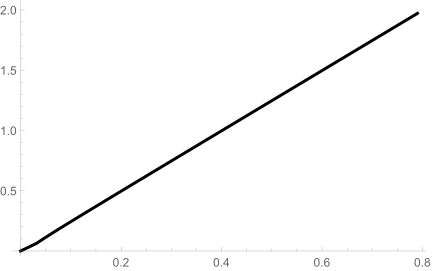

```{r setup, include=FALSE}
knitr::opts_chunk$set(echo = FALSE, warning = FALSE, message = FALSE)
```


## Loop-erased random walk (LERW)

:::: {.columns}

::: {.column}

{width=90%}

:::

::: {.column}


:::

::::

* @schramm2000scaling
  :  Loop-erased random walk $\implies$ $\operatorname{SLE}_{2}.$

## Harmonic explorer

:::: {.columns}
::: {.column width="70%}

{width=99%}

:::
::: {.column width="30%}

:::
::::

## Harmonic explorer

:::: {.columns}
::: {.column width="70%}

{width=99%}

:::
::: {.column width="30%}
* Consider $f=1$ on $\bullet,$ $f=0$ on $\color{red}{\bullet}.$
* Then there exists a unique harmonic function $u$ defined on all sites in $D$ such that $u=f$ on all $\bullet,\color{red}{\bullet}.$
* Coloring $\circ$ randomly by 
  \begin{align*}
    \begin{aligned}
    \mathbf{P}[\circ = \bullet]=u(\circ), \quad
    \mathbf{P}[\circ = \color{red}{\bullet}] = 1-u(\circ).
    \end{aligned}
  \end{align*}
:::
::::

```{r, results='asis'}
for (i in 3:14) {
  cat("## Harmonic explorer\n\n")
  cat(paste0(", ".svg" ,"){width=46%}\n\n"))
  }
```

## Harmonic explorer

:::: {.columns}
::: {.column width="70%}

{width=99%}

:::

::: {.column width="30%}

Theorem. @schramm2005harmonic
: Harmonic explorer $\implies$ $\operatorname{SLE}_4.$ 

:::
::::

```{r, results='asis'}
for (i in 1:4) {
  cat(paste0("## Uniform spanning tree (UST) Peano curve\n\n, ".svg" ,"){width=40%}\n\n"))
  }
```

## Uniform spanning tree (UST) Peano curve

:::: {.columns}
::: {.column width="42%"}

{width=100%}

:::

::: {.column}

Theorem. @lawler2004conformal
: UST Peano curve $\implies$ $\operatorname{SLE}_8.$
  
:::
::::


## FK-Ising model 

:::: {.columns}
::: {.column}
{width=80%}
:::

::: {.column}

:::
::::

## FK-Ising model 

:::: {.columns}
::: {.column}
{width=80%}
:::

::: {.column}

* Given $p\in [0,1],q\in (0,\infty).$
* $c(\omega)$: Number of dot lines.
* $o(\omega)$: Number of solid lines.
* $k(\omega)$: Number of components of solids lines.
* $\mathbf{P}(\omega)=C p^{o(\omega)} (1-p)^{c(\omega)} q^{k(\omega)}.$

:::
::::

## FK-Ising model 

:::: {.columns}
::: {.column}
{width=80%}
:::

::: {.column}

* Given $p\in [0,1],q\in (0,\infty).$
* $c(\omega)$: Number of dot lines.
* $o(\omega)$: Number of solid lines.
* $k(\omega)$: Number of components of solids lines.
* $\mathbf{P}(\omega)=C p^{o(\omega)} (1-p)^{c(\omega)} q^{k(\omega)}.$

:::
::::

## FK-Ising model 

:::: {.columns}
::: {.column}
{width=80%}
:::

::: {.column}

* Given $p\in [0,1],q\in (0,\infty).$
* $c(\omega)$: Number of dot lines.
* $o(\omega)$: Number of solid lines.
* $k(\omega)$: Number of components of solids lines.
* $\mathbf{P}(\omega)=C p^{o(\omega)} (1-p)^{c(\omega)} q^{k(\omega)}.$

:::
::::

## FK-Ising model 

:::: {.columns}
::: {.column}
{width=80%}
:::

::: {.column}

* Given $p\in [0,1],q\in (0,\infty).$
* $c(\omega)$: Number of dot lines.
* $o(\omega)$: Number of solid lines.
* $k(\omega)$: Number of components of solids lines.
* $\mathbf{P}(\omega)=C p^{o(\omega)} (1-p)^{c(\omega)} q^{k(\omega)}.$

:::
::::

## FK-Ising model 

:::: {.columns}
::: {.column}

{width=80%}

:::

::: {.column}

* Given $p\in [0,1],q\in (0,\infty).$
* $c(\omega)$: Number of dot lines.
* $o(\omega)$: Number of solid lines.
* $k(\omega)$: Number of components of solids lines.
* $\mathbf{P}(\omega)=C p^{o(\omega)} (1-p)^{c(\omega)} q^{k(\omega)}.$
* Critical FK-Ising model: $q=2,$ $p=\dfrac{\sqrt{q}}{1+\sqrt q}.$
  
* Theorem. @smirnov2010conformal, @chelkak2014convergence
  : Critical FK-Ising model $\implies$ $\operatorname{SLE}_{16/3}.$
  
* Conjecture. 
  : For $q\leq 4,$
    FK-Ising model $\implies$ $\operatorname{SLE}_{\kappa},$
    where $$\kappa=\frac{4\pi}{\arccos(-\sqrt{q}/2)}.$$

:::
::::

## SLEs and discrete models

$\operatorname{SLE}$ | Models | Reference
:-------: | :-------: | -------:
$\operatorname{SLE}_{2}$ | (conditioned) Loop-erased random walk (LERW) | @lawler2004conformal, @zhan2008scaling, @bauer2009conditioning
Chordal $\operatorname{SLE}_{\frac{8}{3}}$ | Self-avoiding walk (SAW) | @lawler2002scaling (Conjecture)
Chordal $\operatorname{SLE}_{3}$ | Critical spin-Ising model | @chelkak2012universality, @chelkak2014convergence
Dipolar $\operatorname{SLE}_{3}$ | Ising model with plus-minus-free boundary conditions | @bauer2005dipolar, @hongler2013ising
Chordal $\operatorname{SLE}_{4}$ | Harmonic explorer (HE) | @schramm2005harmonic
Chordal $\operatorname{SLE}_{4}$ | Discrete Gaussian free field (DGFF) | @schramm2009contour
Chordal $\operatorname{SLE}_{\frac{16}{3}}$ | Critical FK-Ising model | @smirnov2010conformal, @chelkak2014convergence
Chordal $\operatorname{SLE}_{6}$ | Critical percolation exploration on the triangular lattice | @Smirnov2001CriticalPI, @camia2007critical
Chordal $\operatorname{SLE}_{8}$ | Uniform spanning tree (UST) Peano curve | @lawler2004conformal 


## Why $B_t?$ ①


:::: {.columns}
::: {.column width="40%"}

* Given iid $G_{\varepsilon}:$
  \begin{align*}
    \begin{aligned}
    \color{red}{G_{\varepsilon}=U_{\varepsilon}+z+\frac{2\varepsilon}{z}+\cdots}, \cr 
    \color{orange}{G_{\varepsilon}=U_{\varepsilon}+z+\frac{2\varepsilon}{z}+\cdots}, \cr
    \color{blue}{G_{\varepsilon}=U_{\varepsilon}+z+\frac{2\varepsilon}{z}+\cdots}.
    \end{aligned}
  \end{align*}

:::

::: {.column width="60%"}

* Comcosition of iid $G_{\varepsilon}:$
  \begin{align*}
    \begin{aligned}
    \color{blue}{G_{\varepsilon}} \color{black}{\circ} \color{orange}{G_{\varepsilon}} \color{black}{\circ} \color{red}{G_{\varepsilon}} \color{black}= \color{blue}{U_{\varepsilon}}+\color{orange}{U_{\varepsilon}}+\color{red}{U_{\varepsilon}}+z+\frac{2\cdot 3\varepsilon }{z} + \cdots.
    \end{aligned}
  \end{align*}

* $\color{blue}{U_{\varepsilon}}+\color{orange}{U_{\varepsilon}}+\color{red}{U_{\varepsilon}}$ is a random walk, 
  hence we may consider $(U_t)_{t\geq 0}$ is a Brownian motion with some speed.

:::
::::

## Why $B_t?$ ②

:::: {.columns}
::: {.column width="50%"}


* Suppose we have a random curve $\gamma(0,\infty).$ (Consider the interface of percolation).
* Given $\gamma[0,s].$
 
* Let $\overline{\gamma}(t):= g_s\big( \gamma(t+s) \big) - g_s\big( \gamma(s) \big).$

* Let $\overline{g}_t$ be the Loewner chain of $\overline{\gamma}(0,t].$
  Then
\begin{align*}
  \begin{aligned}
  \overline{g}_t(z) &= g_{t+s}\circ g_s^{-1}(z+U_s) -U_s, \cr 
  \partial_t \overline{g}_t(z) &= \frac{2}{\overline{g}_t(z)-\overline U_t} , \quad \overline U_t=U_{s+t}-U_s.
  \end{aligned}
\end{align*}

* It is natural to consider that 

  1. $\overline{\gamma}[0,\infty)\stackrel{\operatorname{law}}{=}\gamma[0,\infty).$
  2. $\overline{\gamma}[0,\infty)$ and $\gamma[0,s]$ are independent.

:::

::: {.column width="50%"}

* Then on $(U_t)_{t\geq 0},$ it is

  1. $(U_{t+s}-U_s)_{t\geq 0}\stackrel{\operatorname{law}}{=}(U_t)_{t\geq 0}.$
  2. $(U_{t+s}-U_s)_{t\geq 0}$ and $(U_t)_{t\in [0,s]}$ are independent.

* Since $(U_t)_{t\geq 0}$ is continuous, we can write 
  $$U_t=\mu t + \sqrt{\kappa} B_t$$
  for some $\mu\in \mathbb{R}$ and $\kappa\in (0,\infty)$
  and for some $B$ a standard one dimensional Brownian motion.

* Since the law of $\gamma$ is invariant if we rotate around $y$-axis,
  we have 
  $$(U_t)_{t\geq 0}\stackrel{\operatorname{law}}{=}(-U_t)_{t\geq 0}$$
  which implies $\mu=0.$

:::
::::


## Cardy's formula (Crossing probability)

:::: {.columns}
::: {.column}
Theorem.
: Let $\kappa\in (4,\infty).$ Let $T_z$ be the first time that $(\overline{K_t})_{t\geq 0}$ swallows $z.$ 
  Then, for $x>0,$
  \begin{align*}
    \begin{aligned}
    \mathbf{P} \big[ T_{-x}>T_1\big] = \frac{\Gamma(2-4a)}{\Gamma(1-2a)^2} \int_0^{\frac{x}{1+x}} \frac{1}{t^{2a}(1-t)^{2a}} \mathrm{d} t,
    \end{aligned}
  \end{align*}
  where $a=2/\kappa.$


:::

::: {.column}
* This formula is simple for $\kappa=6$ and in an equilateral triangle.

@smirnov2001critical (Cardy's formula in Carleson's form)
: Let $\Delta=ABC, \, A=(0,0), \, B=(1,0), \, C=e^{i\pi/3},\, D=rC.$
  Let $(\gamma_t)_{t\geq 0}$ be the trace of a $(\Delta,A,C)$-chordal $\operatorname{SLE}_6$
  and $\tau_1,\tau_2$ be the first times that $(\gamma_t)_{t\geq 0}$ hits $\overline{DC},\overline{BC},$ respectively.
  Then
  \begin{align*}
    \begin{aligned}
    \mathbf{P}\big[ \tau_1 > \tau_2  \big] = r.
    \end{aligned}
  \end{align*}


:::
::::


## A relation between dipolar SLE and chordal SLE

:::: {.columns}
::: {.column}


Given $x\in (-\infty,0)$ and let $f$ be the conformal transformation 
from $(\mathbb{S},0,\infty,-\infty)$ to $(\mathbb{H},0,\infty,x).$
Then 
\begin{align}
  \begin{aligned}
  f(\text{ dipolar }\operatorname{SLE}_{\kappa}\text{ trace}) \stackrel{\operatorname{law}}{=} K_{\tau},
  \end{aligned}
\end{align}
where $(K_t)_{t\geq 0}$ is the $\mathbb{H}$-hulls generated by the 
$\color{red}{\text{chordal Loewner equation}}$ 
with driving term $(U_t)_{t\geq 0}$ satisfies, with $\rho = (\kappa-6)/2,$
\begin{align}
  \begin{cases}
  \begin{aligned}
  \mathrm{d} U_t &= \frac{\rho} {U_t-V_t} \mathrm{d} t + 
  \sqrt{\kappa} \mathrm{d} B_t  \cr 
  \mathrm{d} V_t &= \frac{2}{V_t-U_t} \mathrm{d} t , \cr 
  U_0 &= 0, \quad  V_0= x , \quad \frac{U_t-V_t}{U_0-V_0}>0,
  \end{aligned}
  \end{cases}
\end{align}
and $\tau$ is the first time that $(K_t)_{t\geq 0}$ hits $(-\infty,x]$ (first time eat $x$).

:::

::: {.column}

* The solution $(U_t,V_t)$ can be constructed by a Bessel process with parameter $(\rho+2)/\kappa$:
\begin{align*}
  \begin{aligned}
  \mathrm{d} Z_t &= \frac{\rho+2}{Z_t} \mathrm{d} t + \sqrt{\kappa} \mathrm{d} B_t , &   Z_0 &= -x; \cr 
  \mathrm{d} V_t &= \frac{-2}{Z_t} \mathrm{d} t  , &   V_0 &= x; \cr 
  U_t &= Z_t + V_t.   
  \end{aligned}
\end{align*}

:::
::::

## Reflected BM

The reflected BM $B$ is defined as the follows:

* Let $u(x)=e^{i\pi/3}$ if $x\geq 0$ and $u(x)=e^{2i\pi/3}$ if $x<0.$
* Let $W$ be a planar BM started from $0.$

Then there exist a unique pair $(B_t,\ell_t)$ of continuous processes such that

* $B_t$ takes its values in $\overline{\mathbb{H}},$
* $\ell_t$ is a non-decreasing real-valued function with $\ell_0=0$ that increases only when $B_t\in \mathbb{R},$ and
* $B_t=W_t+\int_0^t u(B_s)\mathrm{d} \ell_s.$


## ⭐ Some problems

### SLE with initial distribution $U_0$? (This problem is from the reverse of a dipolar SLE).

* Need to study the Bessel process with initial distribution.
* For $\kappa=2,$ in @bauer2009conditioning, we have 
  
    


## ⭐ Some problems

### $\operatorname{SLE}_1$?

* The density (without normalization) of the terminal point of the $(\mathbb{H},\infty,[-1,1])$-dipolar $\operatorname{SLE}_{\kappa}$ trace on $[-1,1]$ are as follows.

{width=70%}


## ⭐ Some problems

### Radial decomposition for $\operatorname{SLE}_{8/3}$?

{width=32%}
{width=33%}
{width=32%}

## ⭐ Some problems

### $U_t=K_t?$

:::: {.columns}
::: {.column}
* $U_t=t.$
  
  {width=49%}
  {width=49%} 
:::

::: {.column}

* $U_t=t^{1/2}.$
  
  {width=49%}
  {width=49%} 
:::
::::

## Reference